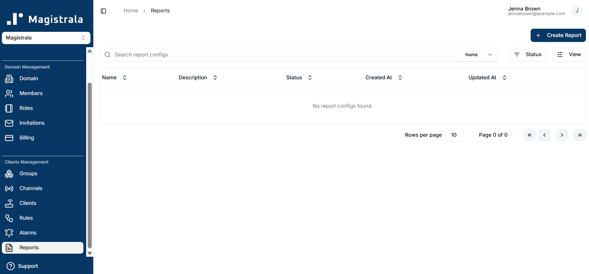
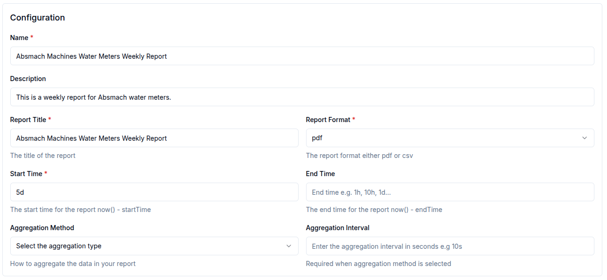
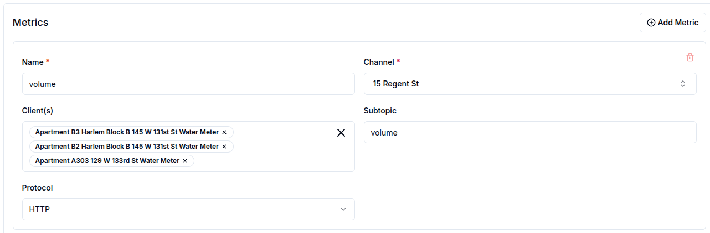
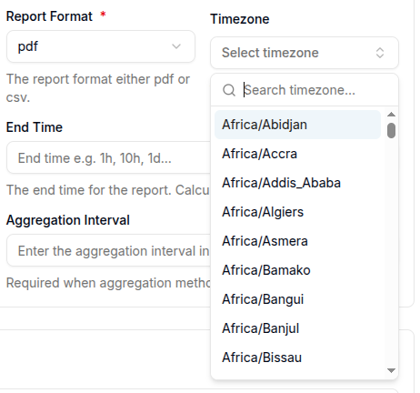
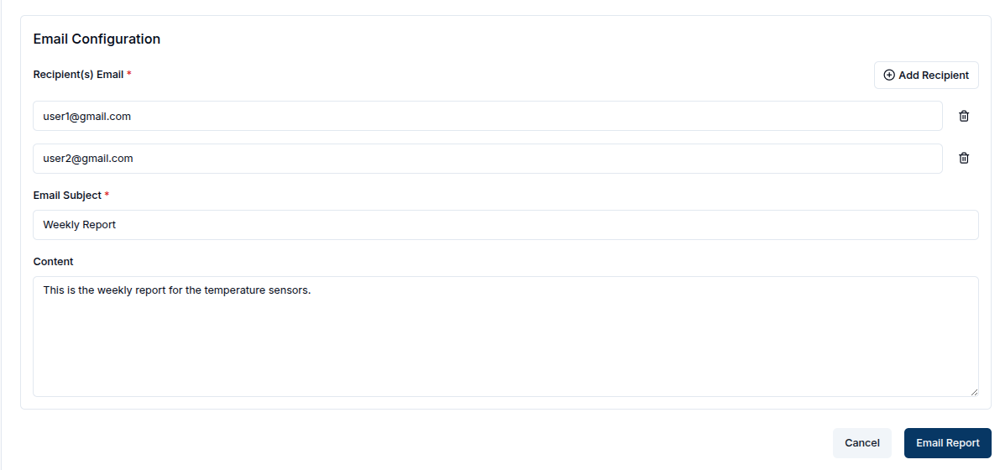
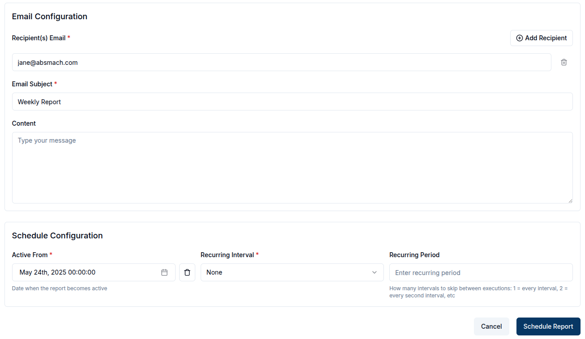
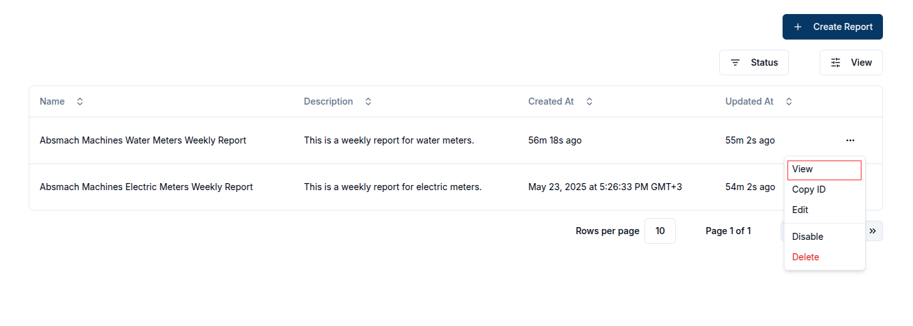
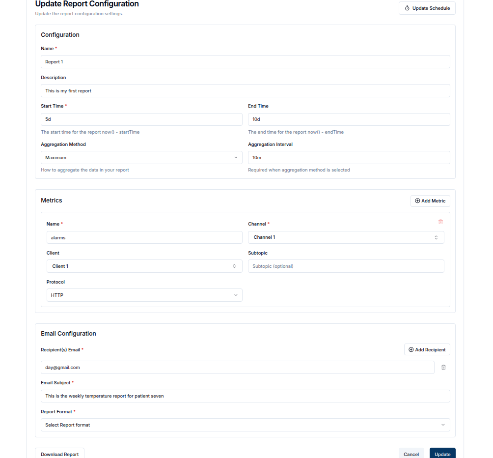
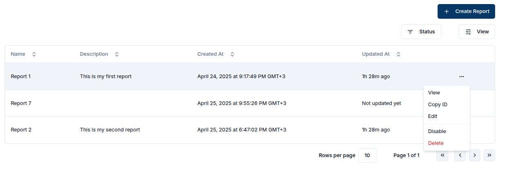

## Overview

The **Reports** service enables users to generate, schedule, email and download data reports from connected devices and sensors.

## Create a report

To create a report, click the `Create Report` button at the top right of the reports page.

This action redirects  users to report creation page where required details can be provided. There are two main sections **Configuration** and **Metrics**.

In the Configuration section, the user is required to input general settings for the report such as:

|Property |Description| Required |
|-----------------|------------------------------------------|----------|
|Name |Descriptive name for the report| ✅ |
|Description |Additional context about the report| Optional |
|Report Title | The title for the report | ✅ |
|Report Format | The file format for the report(pdf or csv) | ✅ |
|Start Time | The start time of the report| ✅ |
|End Time | The end time for the report| Optional |
|Timezone | The timezone for displaying timestamps (e.g., "America/New_York", "Europe/London"). Defaults to UTC if not specified | Optional |
|Aggregation Method | The aggregation method e.g Maximum, Minimum e.t.c| Optional |
|Aggregation Interval |  The interval used for aggregating messages | Optional |

In the Metrics section, users can define specific filters such as:

|Property |Description| Required |
|-----------------|------------------------------------------|----------|
|Name | The value name of the message| ✅ |
|Channel | The channel that subscribed to the message|  ✅ |
|Clients | The clients that sent the messages| Optional |
|Subtopic | The subtopic of the message|  Optional |
|Protocol | The protocol used to send the message (HTTP, MQTT, WebSocket,or COAP)| Optional |

Users can click the `Add Metric` button to add multiple metrics to a single report.

## Timezone Configuration

The Reports service supports timezone-aware timestamp display in generated reports. This allows users to view all timestamps in their preferred timezone rather than UTC.

### How to Use Timezones

When creating or scheduling a report, you can specify a timezone in the **Configuration** section:

1. Enter a valid IANA timezone name in the **Timezone** field (e.g., "America/New_York", "Europe/Paris", "Asia/Tokyo")
2. If left empty, the report will default to UTC
3. The timezone applies to:
   - Report generation timestamps (shown in headers and footers)
   - All message timestamps in both PDF and CSV formats

### Supported Timezone Formats

The service accepts IANA timezone names, such as:

- **Americas**: "America/New_York", "America/Los_Angeles", "America/Chicago"
- **Europe**: "Europe/London", "Europe/Paris", "Europe/Berlin"
- **Asia**: "Asia/Tokyo", "Asia/Shanghai", "Asia/Dubai"
- **Australia**: "Australia/Sydney", "Australia/Melbourne"
- **Africa**: "Africa/Cairo", "Africa/Johannesburg"

**Note:** Invalid timezone names will fall back to UTC automatically, and a warning will be logged.

### Generate an instant report

To generate an instant report, click the `Generate Instant Report` button. The report will be generated based on the provided configuration.

### Download a report

To download a report, click the `Download Report` button. The report will be downloaded in the format specified in the report format field.

### Email a report

To email a report, click the `Email Report` button, fill in the required fields, and the report will be sent to the specified recipients.

### Schedule a report

To schedule a report, click the `Schedule Report` button and two sections (**Email Configuration** and **Schedule Configuration** )appear.

In Email Configuration, users can configure how the report will be sent via email.
The fields to be filled include:

|Property |Description| Required |
|-----------------|------------------------------------------|----------|
|Recipient(s) Email | The recipient's email address(es)| ✅ |
|Email Subject | The subject line of the email  |  ✅ |
|Report Format | The file format for the report (PDF or CSV).| ✅ |

In Schedule Configuration, users can configure when the report should be sent.  
The fields to be filled include:

|Property |Description| Required |
|-----------------|------------------------------------------|----------|
|Active From  | The start date for the report| ✅ |
|Occurs at | The time of the report should be sent  |  ✅ |
|Recurring Interval | How often the report should repeat (e.g., daily, weekly). | ✅ |
|Recurring Period | How many intervals to skip between executions (e.g., 1 = every interval, 2 = every second interval, etc.).|  Optional |

## View a report

After a report is created, it will be added to the reports table. To view a report,  click the row or click the `View` button in the row actions.

## Update a report

While on the View Report Page, the user can update the details of the report, modify the schedule, add metrics or recipients, or download the report.

## Delete a report

To delete a report, click the `Delete` button in the row actions.

