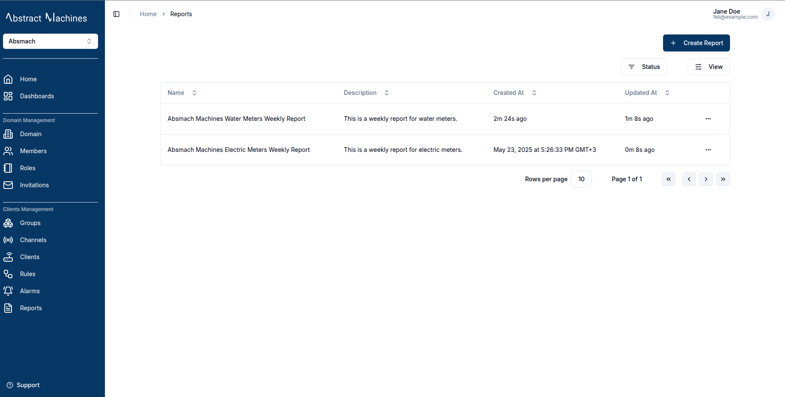
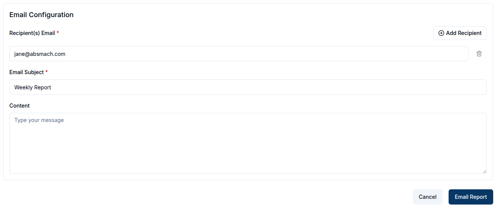
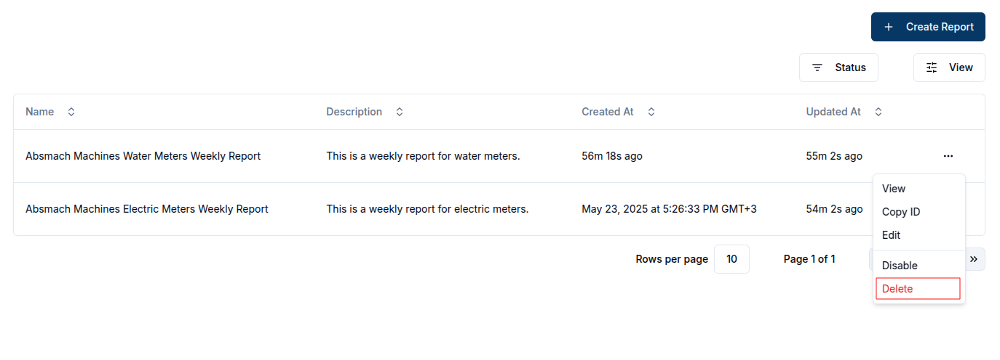

## Overview

The **Reports** service enables users to generate, schedule, email and download data reports from connected devices and sensors.

## Create a report
To create a report, click on `Create Report` button at the top right of the reports page.

This action redirects the user to reports creation page where required details can be provided. There are two main sections **Configuration** and **Metrics**.

In the Configuration section, the user is required to input general settings for the report such as:

|Property |	Description	| Required |
|-----------------|------------------------------------------|----------|
|Name | 	Descriptive name for the report	| ✅ |
|Description | 	Additional context about the report	| Optional |
|Report Format | The file format for the report	(pdf or csv) | Optional |
|Start Time | The start time of the report	| ✅ |
|End Time | The end time for the report	| Optional |
|Aggregation Method | 	The aggregation method e.g Maximum, Minimum e.t.c	| Optional |
|Aggregation Interval |  The interval used for aggregating messages | Optional |

In the Metrics section, users can define specific filters such as:

|Property |	Description	| Required |
|-----------------|------------------------------------------|----------|
|Name | 	The subtopic of the message| ✅ |
|Channel | 	The channel that subscribed to the message|  ✅ |
|Client | 	The client used to send the message	| Optional |
|Subtopic | The subtopic of the message	|  Optional |
|Protocol | The protocol used to send the message (HTTP, MQTT, WebSocket or COAP)| Optional |

The user can click the `Add Metric` button to add multiple metrics to a single report.

### Generate an instant report
To generate an instant report, click on `Generate Instant Report` button. The report will be generated based on the provided configuration.

### Download a report
To download a report, click the `Download Report` button. The report will be downloaded in the format specified in the report format field.

### Email a report
To email a report, click the `Email Report` button, fill in the required fields, and the report will be sent to the specified recipients.

### Schedule a report
To schedule a report, click on `Schedule Report` button and two sections (**Email Configuration** and **Schedule Configuration** )appear.

In Email Configuration,  the user can configure how the report will be sent via email.
The fields to be filled include:
|Property |	Description	| Required |
|-----------------|------------------------------------------|----------|
|Recipient(s) Email | 	The recipient's email	| ✅ |
|Email Subject | The subject line of the email  |  ✅ |
|Report Format | The file format for the report (PDF or CSV).		| ✅ |

In Schedule Configuration, the user can configure when the report should be sent.  
The fields to be filled include:
|Property |	Description	| Required |
|-----------------|------------------------------------------|----------|
|Active From  | 	The start date for the report	| ✅ |
|Occurs at | The time of the report should be sent  |  ✅ |
|Recurring Interval | How often the report should repeat (e.g., daily, weekly). 	| ✅ |
|Recurring Interval | How many intervals to skip between executions (e.g., 1 = every interval, 2 = every second interval, etc.).	|  Optional |

## View a report.
After a report is created, it will be added to the reports table. To view a report,  click on the row or click the `View` button in the row actions.

## Update a report
While on the View Report Page, the user can update the details of the report, modify the schedule, add metrics or recipients, or download the report.

## Delete a report
To delete a report, click the `Delete` button in the row actions.

