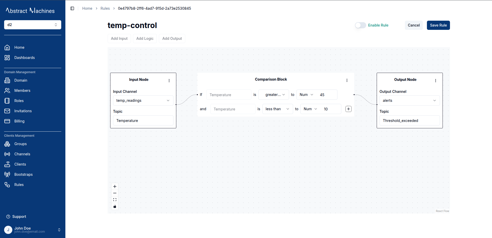
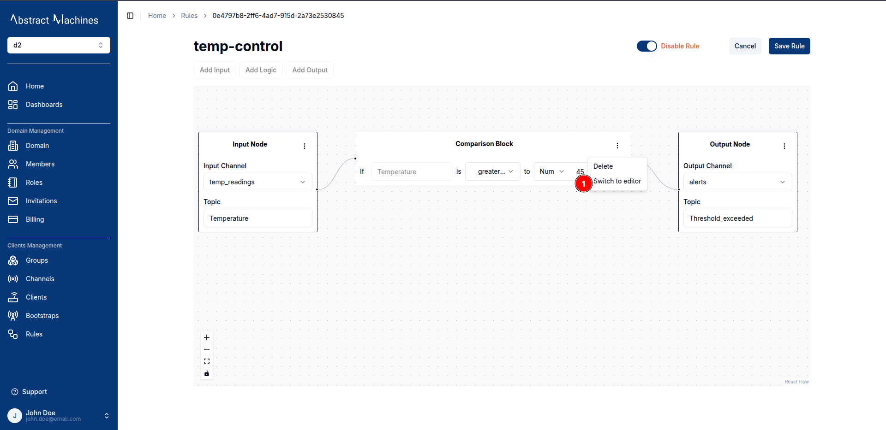
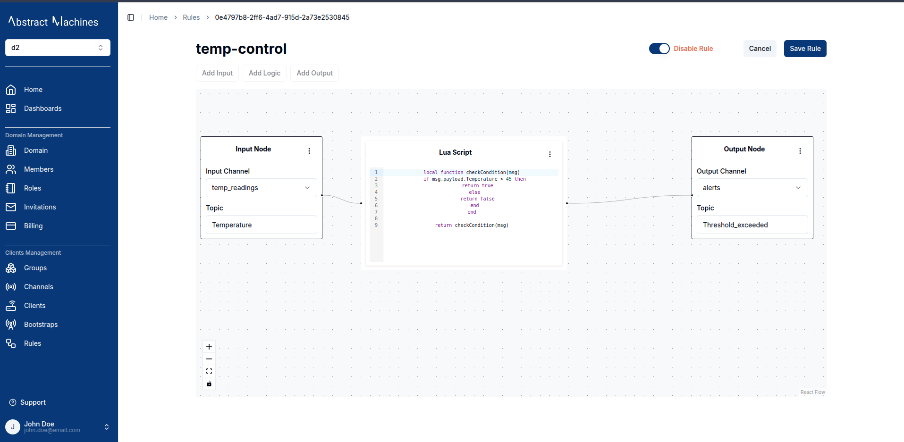

The **Rules Engine** in Magistrala is a feature that allows users to define, manage, and automate message processing logic.
It enables the creation of rules that process input data, apply logical conditions, and output results accordingly.
Users can create rules by attaching input, logic, and output nodes.

## Features

- **Create Rules:** Specify input channel and topic, apply logical conditions, and specify output channel and topic
- **Update Rules:** Modify existing rules, including input, logic, and output nodes.
- **Delete Rules:** Remove rules that are no longer needed.
- **Enable/Disable Rules:** Users can activate or deactivate rules as required.
- **Comparison Blocks:** Add conditional logic to the rules for evaluating message payloads.
- **Lua Script Integration:** Users can switch between a comparison block and a Lua script editor to define custom logic.

## **Create a Rule**

To create a **Rule** navigate to the Rules section and click on the `+ Create` button to open the rule creation dialog. Provide a **name** for the rule and click Create.

Users can view all created rules in a structured list, displaying:

- Rule name
- Status (Enabled/Disabled)
- Creation date

## **View a Rule**

Click on the rule name present at the rules table to be redirected to the Rule's ID page.

From here users can view the Rule's input and output nodes as well as the logic.

## **Updating Rule Status**

Users can enable or diable a Rule by clicking on the Toggle at the top right of the Rule page.

## **Adding Comparison Block**

A **Comparison Block** allows users to define conditions based on message payloads:

- Example conditions:

  - `If temperature is greater than 10`
  - `And temperature is less than 40`

- Users can combine multiple conditions using **AND/OR** operators.

## **Switching Between Logic Types**

Users can switch between a **Comparison Block** and **Lua Script** editor:

1. Click on the options menu (`...`) in the logic node.
2. Select `Switch to editor` to enter the Lua script mode.
3. Enter the custom script for message processing.
4. Save the changes.

