## Overview

The **Rules Engine** helps automate message processing using visual workflows composed of input sources, logic evaluations, and output destinations.
Users can define rules by visually combining input, logic, and output nodes to determine how incoming messages are processed, evaluated, and responded to.

## Features

### 1. Creation and Management

- **Create Rules**: Define the name of a new rule and initiate creation.
- **Quick Actions**: View, copy ID, enable/disable, or delete a rule directly from the list.

### 2. Node Configuration

- **Input Nodes**: Attach an MQTT subscriber input by selecting the channel and topic.
- **Logic Nodes**: Define conditions using comparison blocks, Lua scripts, or Go scripts.
- **Output Nodes**: Output processed data to MQTT publishers, Email recipients, or PostgreSQL databases.

### 3. Scripting and Templating

- **Lua Script Editor**: Use custom Lua scripts with a required `logicFunction()` for logic processing.
- **Go Script Editor**: Write Go-based logic for more advanced use cases (requires Go syntax compliance).
- **Go Text Templating**: Use dynamic value injection with:
  - `{{.Result}}`
  - `{{.Result.<key>}}`
  - `{{.Message.<key>}}`

### 4. Scheduling and Execution

- **Scheduling**: Define execution windows with start time, specific time, recurring intervals, and periods.
- **Connection Layout**: Visually connect all nodes to complete and activate a rule.

## Use Cases

Here are some practical examples of how you can use the Rules Engine:

- `Temperature Alerts`: Notify users by email when temperature exceeds safe limits.

- `Message Filtering`: Only forward messages with specific fields or values.

- `Unit Conversion`: Convert sensor data from Celsius to Fahrenheit before publishing.

## Create a Rule

Navigate to the **Rules** section and click on the `+ Create` button. Provide a **name** for your rule and click **Create**.

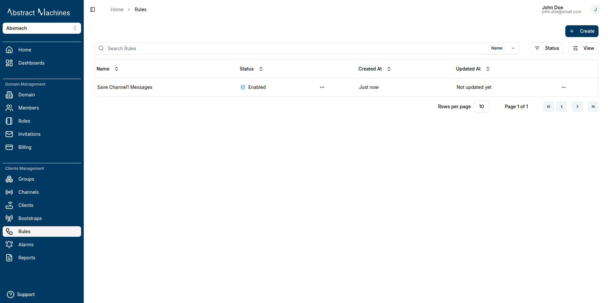


### After creation, the rule appears in a list with the following details

1. Rule Name
2. Status (Enabled/Disabled)
3. Creation Date

#### Each rule entry also has quick actions for

- Viewing the rule
- Copying the rule ID
- Enabling/Disabling the rule
- Deleting the rule

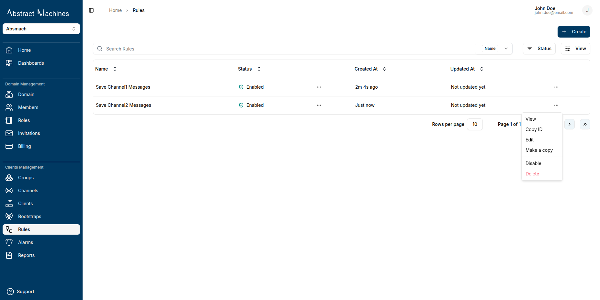

## View a Rule

Click the rule name in the rules table to open the rule’s page.

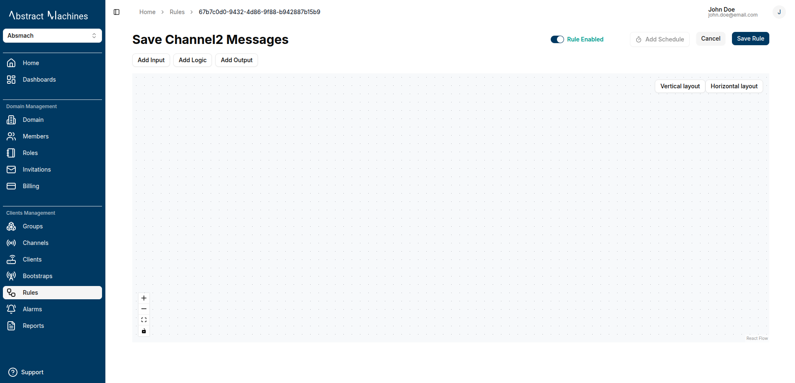

On the rule page, you can configure the following:

### 1. Input Node

- Currently, only one input node is supported per rule.


- Select **MQTT Subscriber** as the input type.
- Choose the **channel** and **topic** to subscribe to.

  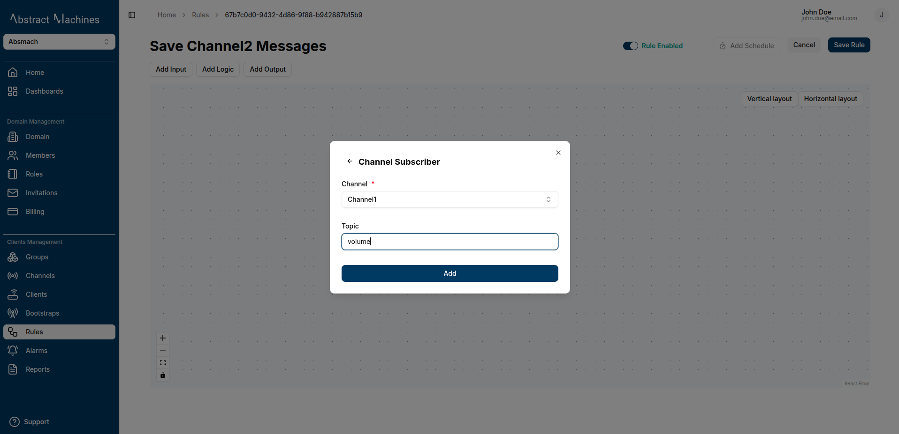

- The input node will appear in the layout.

  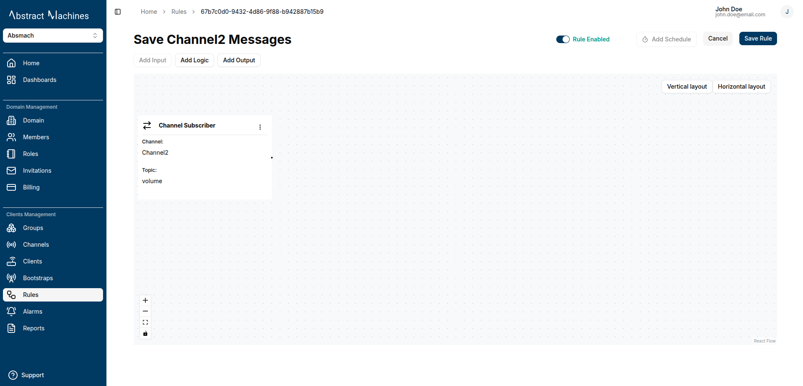

### 2. Logic Node

After setting the input, define your rule’s logic using one of three options:

1. Comparison Block
2. Lua Script Editor
3. Go Script Editor

The logic nodes support different message payloads as inputs.  
To utilize the message payload, you can use `message.<key>` in the input. For example if your message is a single SenML message, you can do `message.payload.v` to get the value.

#### Comparison Block

Use `if`, `and` and `or` conditions to evaluate message payloads:

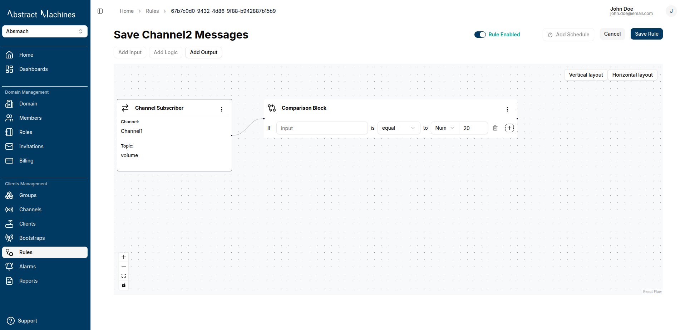

**Supported Payload Structures**:

- Nested objects: `message.<key>.<key>` (e.g., `message.payload.sensor.temperature`).
- **SenML fields**: `v` (numeric), `vs` (string), `vb` (boolean), `vd` (data), `s` (sum).

**Multiple Conditions**:  
Chain conditions with `and` / `or`:


#### Script Editors

The script editor allows you to toggle between Lua and Go modes using the selector at the top of the editor:


**Toggle between:**

- Lua script mode (default)
- Go script mode

##### Lua Script Editor

Write custom logic in Lua. Wrap code in `logicFunction()` and return a primitive or table:


Example:

```Lua title="Return an object (e.g., converted temperature)"
function logicFunction()
  local converted_temp = (message.payload.v * 1.8 + 32)
  return {n = "Temp_fahrenheit", v = converted_temp, u = "°F", }
end
```

```Lua title="Returns a primitive"
function logicFunction()
  return (message.payload.v * 1.8 + 32)
end
```

##### Go Script Editor

Write Go-based logic for advanced use cases. Return a value or struct:

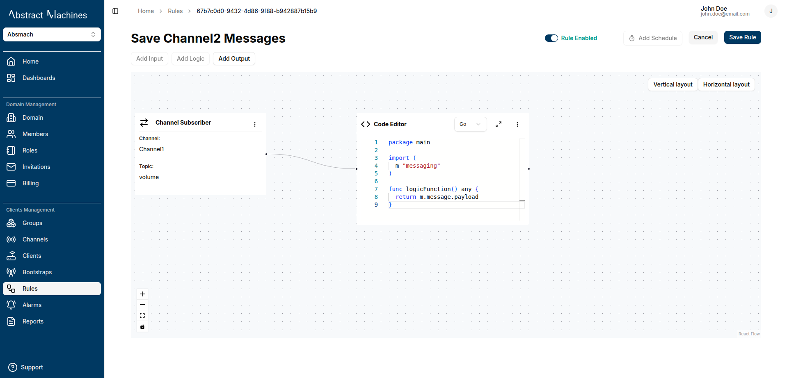

Example:

```go
  package main

  import (
      m "messaging"
  )
  func logicFunction() any {
      return m.message.Payload
  }
```

> **Note:**  
> Output nodes **only trigger if the script returns a truthy value**.  
> If the logic node returns `false`, **the connected output nodes will not be executed**.  
> This allows for conditional flows, ensuring actions such as MQTT publishing, email alerts, or database inserts only occur when the specified logic conditions are satisfied.

### 3. Output Node

You can add one or more output nodes. The following nodes are supported:

1. Channel publisher
2. Email
3. PostgreSQL
4. Alarm
5. Magistrala DB

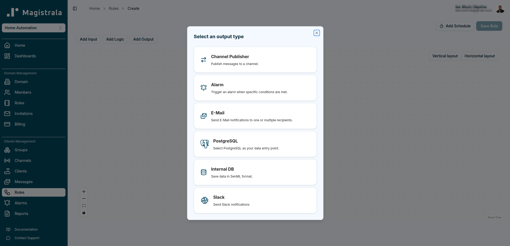

#### Channel Publisher

Enables you to specify the output channel and topic. The result of the logic node is published to this topic.

Select the Channel Publisher as the output node and enter the channel and topic.

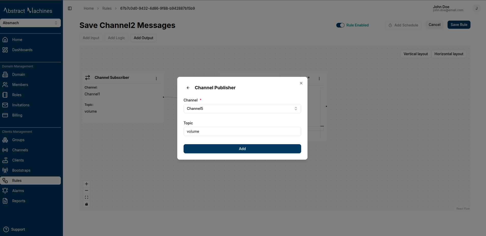


#### Email

Send results via email with templated fields:

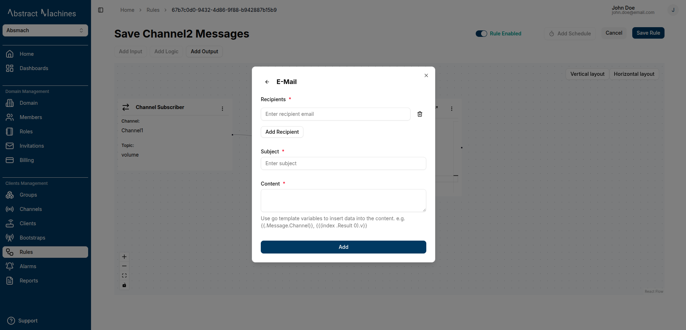

```go title="Subject"
Current Volume
```

- Use dynamic template fields:
  - `{{.Result}}` — the entire result from logic block
  - `{{.Result.<key>}}` — a specific field from the result
  - `{{.Message.<key>}}` — a field from the original message

```go title="Content"
 Current volume is {{(index .Result 0).v}} {{(index .Result 0).u}}.
```


#### PostgreSQL

Store message processing results to your PostgreSQL database. Select the PostgreSQL output node option and enter the following information:


- Host
- Port
- Username
- Password
- Database name
- Table name
- Map data to table columns using templates

```go title="Go template mapping"
{
  "channel": "{{.Message.Channel}}",
  "value":   "{{(index .Result 0).v}}",
  "unit":    "{{(index .Result 0).u}}"
}
```

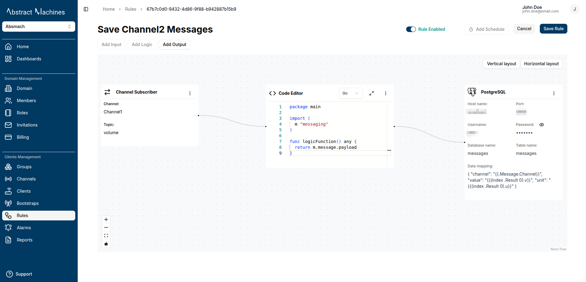

#### Internal DB

To be able to store messages in the internal Magistrala DB, you need to create a rule that processes the results. More information about this is in the [Store Messages](#store-messages) section.

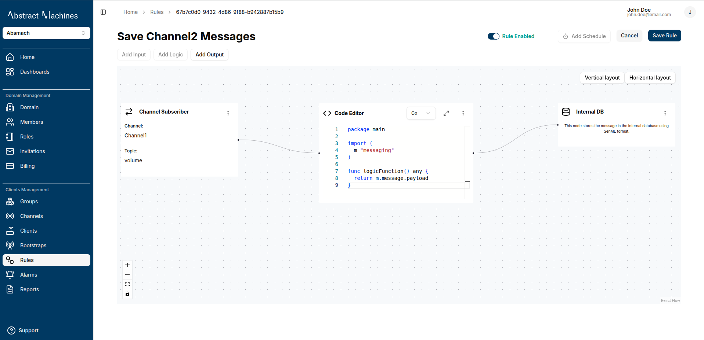

#### Alarms

An alarm output will enable you to be able to generate alarms in the case where a threshold has been exceeded. More information about this node is provided in the [Alarms](/docs/user-guide/alarms.md) section.

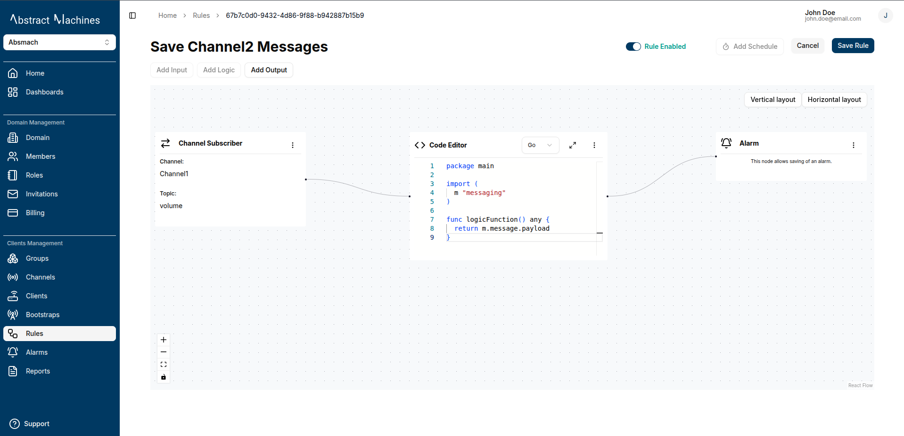

## Dynamic Variables and Templates

You can inject dynamic values from your message or logic result using templating variables.

Available template variables:

| Variable                | Description                        | Example                   |
| ----------------------- | ---------------------------------- | ------------------------- |
| `{{.Result}}`           | Entire output from the logic node. | `{{.Result}}`             |
| `{{.Result.<key>}}`     | Field from the logic result.       | `{{.Result.v}}`           |
| `{{.Message.<key>}}`    | Field from the input message       | `{{.Message.Channel}}`    |
| `{{(index .Result 0)}}` | Access slices/arrays               | `{{(index .Result 0).v}}` |

These variables work in outputs like:

- Email (body)

- PostgreSQL (column mapping)

```Lua title="Example usage in Email message"
Current temperature is {{.Result.CelValue}}°C  or ({{.Result.FarValue}}°F).

```

```Lua title="Example usage in PostgreSQL column mapping"
{
  "channel": "{{.Message.Channel}}",
  "value":   "{{(index .Result 0).v}}",
  "unit":    "{{(index .Result 0).u}}"
}

```

## Connecting Nodes and Save

Once you've added the input, logic, and output nodes, connect them visually in the layout.
Click Save to finalize the rule.


## Enable or Disable Rules

To enable or disable a rule:

- Use the toggle at the top right of the rule page.

  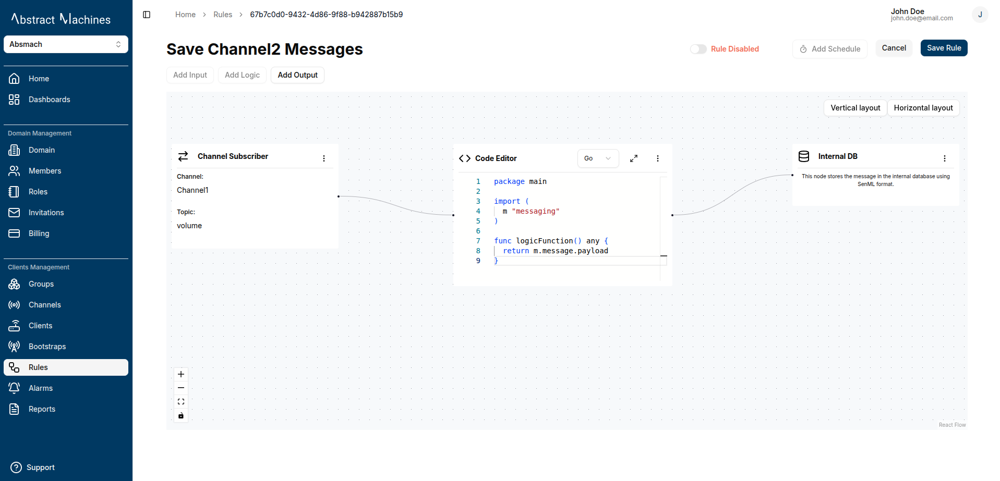

- You can also enable/disable directly from the rule list using the quick actions menu

  

## Add a Scheduler

You can configure a scheduler to define when a rule executes.

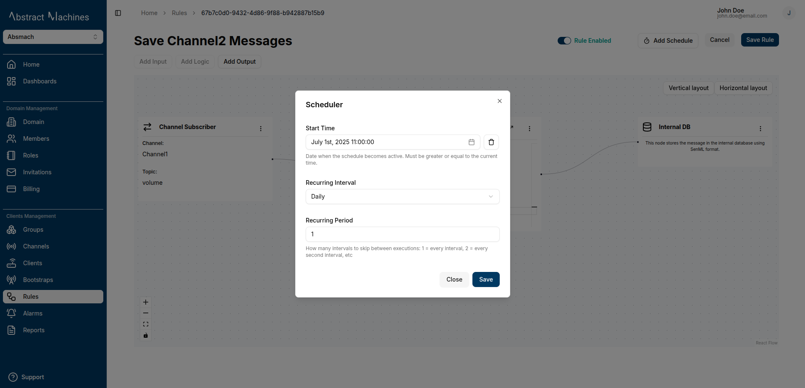

Fields:

- **Start Time**: Date when the schedule becomes active
- **Time**: Time of day the rule should run
- **Recurring Interval**: Unit of recurrence (e.g., daily, hourly)
- **Recurring Period**: Frequency of execution (e.g., every 2 intervals = every other day/hour)

This helps automate rule execution based on custom schedules.

## Store Messages

To store messages in Magistrala's internal database, you must create a **Rule** for this.

- Magistrala only stores messages in [**SenML** format](https://datatracker.ietf.org/doc/html/rfc8428#section-4.3).
- You can submit data in any format(e.g, JSON), but must convert it to SenML using a Lua script.
  SenML format fields:

  | Name          | Label | CBOR Label | JSON Type   | XML Type    |
  | ------------- | ----- | ---------- | ----------- | ----------- |
  | Base Name     | bn    | -2         | String      | string      |
  | Base Time     | bt    | -3         | Number      | double      |
  | Base Unit     | bu    | -4         | String      | string      |
  | Base Value    | bv    | -5         | Number      | double      |
  | Base Sum      | bs    | -6         | Number      | double      |
  | Base Version  | bver  | -1         | Number      | int         |
  | Name          | n     | 0          | String      | string      |
  | Unit          | u     | 1          | String      | string      |
  | Value         | v     | 2          | Number      | double      |
  | String Value  | vs    | 3          | String      | string      |
  | Boolean Value | vb    | 4          | Boolean     | boolean     |
  | Data Value    | vd    | 8          | String (\*) | string (\*) |
  | Sum           | s     | 5          | Number      | double      |
  | Time          | t     | 6          | Number      | double      |
  | Update Time   | ut    | 7          | Number      | double      |

### Example: Convert JSON to SenML

Assume your incoming payload is:

```json
{
  "temperature": 28.5,
  "unit": "C",
  "sensor": "room-1"
}
```

Use the following scripts to convert it:

```Lua title="Lua script"
function logicFunction()
  return {
    n = message.payload.sensor,
    v = message.payload.temperature,
    u = message.payload.unit
  }
end
```

```go title="Go script"
package main
import (
  m "messaging"
)

func logicFunction() any {
return {
    n: m.message.payload.sensor,
    v: m.message.payload.temperature,
    u: m.message.payload.unit
  }
}
```

> This returns a valid SenML message the internal DB will accept.

<br/>
Then set your output node to store this result using the Magistrala internal DB option.

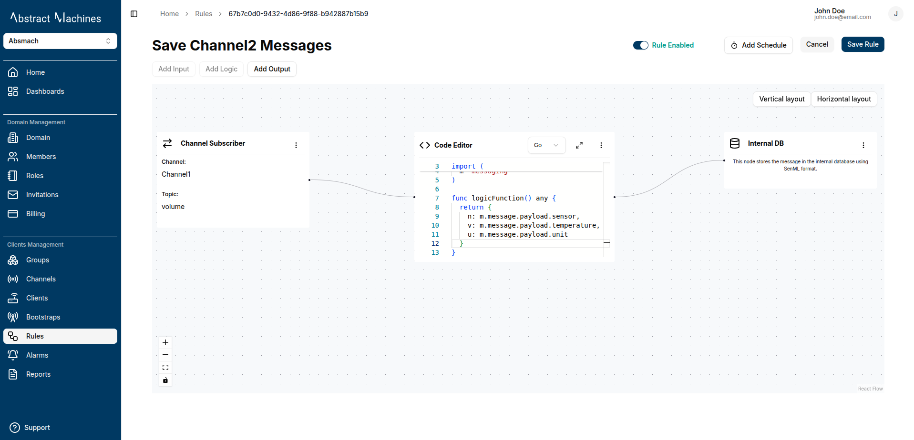

### Example: Input is SenML

If your message payload is already SenML format, you can just return the message payload directly in your script functions:

```lua title="Lua script"
function logicFunction()
  return message.payload
end
```

```go title="Go script"
  package main

  import (
      m "messaging"
  )
  func logicFunction() any {
      return m.message.Payload
  }
```


:::info

With the Rules Engine, users can easily automate data processing pipelines in a powerful and visual way by combining inputs, logical conditions, and flexible outputs.

:::
