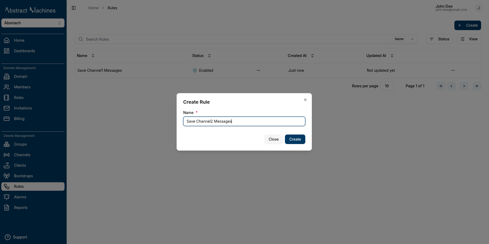
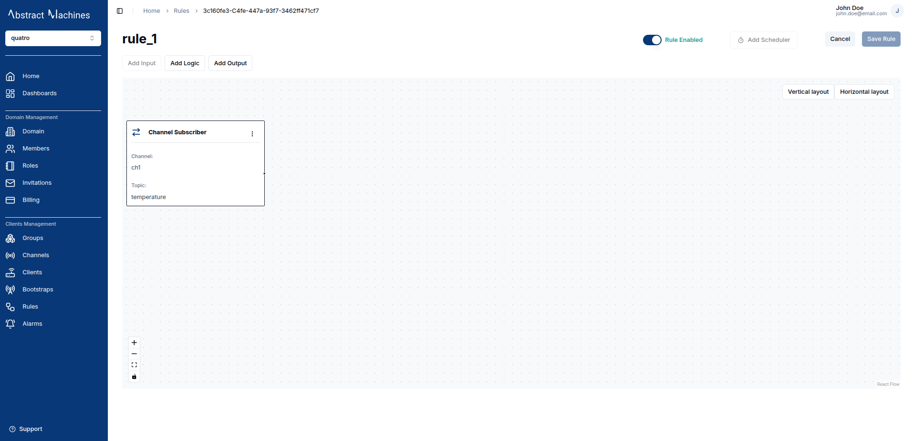
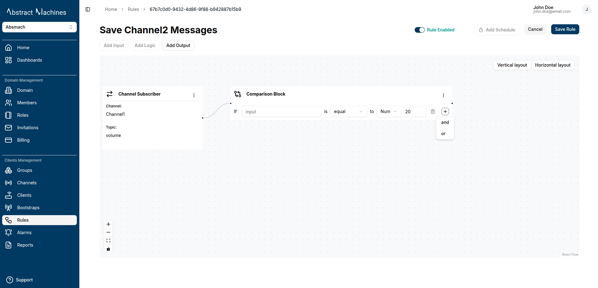
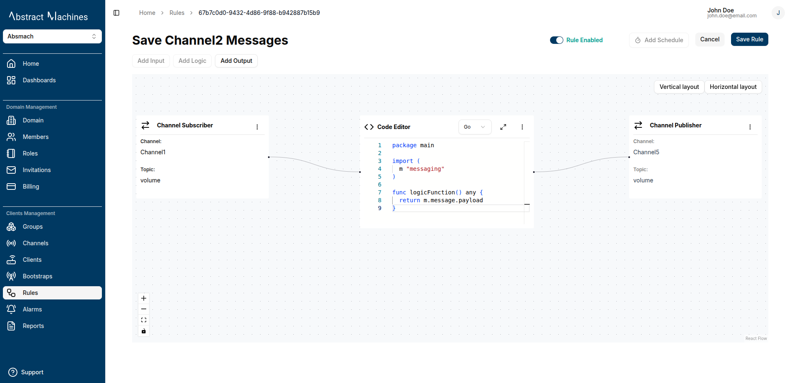
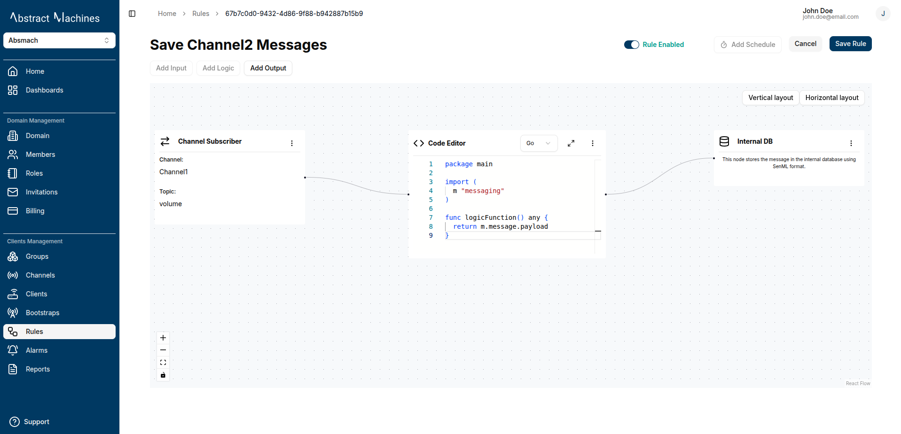

The **Rules Engine** in Magistrala allows users to define, manage, and automate message processing logic.
It enables users to create rules by combining input, logic, and output nodes, defining how messages are processed, evaluated, and acted upon.

## Features

- **Create Rules**: Define the name of a new rule and initiate creation.
- **Quick Actions**: View, copy ID, enable/disable, or delete a rule directly from the list.
- **Input Nodes**: Attach an MQTT subscriber input by selecting the channel and topic.
- **Logic Nodes**: Use either comparison blocks or Lua scripts to define logic conditions.
- **Output Nodes**: Output processed data to MQTT publishers, Email recipients, or PostgreSQL databases.
- **Lua Script Integration**: Use custom Lua scripts with a required `logicFunction()` for advanced logic.
- **Templated Messaging**: Use `{{result}}`, `{{result.key}}`, and `{{message.key}}` to inject dynamic values into messages.
- **Scheduling**: Define execution windows with start time, specific time, recurring intervals, and periods.
- **Connection Layout**: Visually connect all nodes to complete and activate a rule.

## Create a Rule

Navigate to the **Rules** section and click on the `+ Create` button. Provide a **name** for your rule and click **Create**.




#### After creation, the rule appears in a list with the following details:

1. Rule Name
2. Status (Enabled/Disabled)
3. Creation Date

#### Each rule entry also has quick actions for:

- Viewing the rule
- Copying the rule ID
- Enabling/Disabling the rule
- Deleting the rule


## View a Rule

Click the rule name in the rules table to open the Rule’s page.


On the Rule page, you can configure the following:

### 1. Input Node

- Only a single input is supported currently.


- Select **MQTT Subscriber** as the input type.
- Choose the **channel** and **topic** to subscribe to.

  

- The input node will appear in the layout.

  

### 2. Logic Node

After setting the input, you can define the logic of your rule using one of two options:

#### Comparison Block

Use `IF`, `AND` and `OR` conditions to evaluate message payloads:


The input of the comparison block supports the SenML message formats:

1. value
2. string_value
3. bool_value
4. data_value
5. sum

Depending on the type of data you have you can compare the two by changing the type of the comparison value. It can either be `Num`, `Bool` or `String`.

<!--  -->

#### Lua Script Editor

To write custom logic, you can select the editor option of the logic node.


This allows you to write lua script code to process your message. Your Lua script should be wrapped in a function called `logicFunction()` and return a result. The result can be a primitive value or an object.

The lua script allows us to utilize the message object that we subscribe to by using Lua tables to get any values in the message. This also uses SenML format.

Example:

```lua title="Returns an object"
function logicFunction()
  local converted_temp = (message.value * 1.8 + 32)
  return {channel=message.channel, value=converted_temp, unit="°F"}
end
```

```lua title="Returns a primitive"
function logicFunction()
  return (message.value * 1.8 + 32)
end
```

### 2. Output Node

We support the choice of 1 or more output nodes. The following nodes are supported:

1. MQTT publisher
2. E-mail
3. PostgreSQL


#### MQTT Publisher

This allows you to specify the output channel and topic. The result of the logic node is published to this topic.

Select the MQTT Publisher as the output node and enter the channel and topic.




#### Email

This allows you to send the result of the messaging processing to the recipient emails.
Select the E-Mail output node and enter the following information:


- Enter recipient email addresses.
- Specify subject and body message.

```
Subject: Current Temperature
```

- Use dynamic template fields:
  - `{{result}}` — the entire result from logic block
  - `{{result.key}}` — a specific field from the result
  - `{{message.key}}` — a field from the original message

```lua
Message: Current temperature in degrees celcius is {{message.temperature}} {{message.unit}} while the temperature in degrees fahrenheit is {{result.value}} {{result.unit}}.
```


#### PostgreSQL

This allows you to store the results of the message processing to your custom postgres db.
Select the PostgreSQL output node option and enter the following information:


- Host
- Port
- Username
- Password
- Database name
- Table name
- Map data to table columns using templates

```lua
{
  "channel" = "{{message.channel}}",
  "value" = "{{result.value}}",
  "unit" = "{{result.unit}}"
}
```


## Connecting Nodes and Save

After adding input, logic, and output nodes, connect the nodes visually in the layout.
Click Save to finalize the rule.



## Enable or Disable Rules

To enable or disable a rule:

- Use the toggle at the top right of the Rule page.

  

- You can also enable/disable directly from the rule list using the quick actions menu

  

## Add a scheduler

You can configure a scheduler to control when a rule executes.


Fields:

- **Start Time**: Date when the schedule becomes active
- **Time**: Time of day the rule should run
- **Recurring Interval**: Unit of recurrence (e.g., daily, hourly)
- **Recurring Period**: Frequency of execution (e.g., every 2 intervals = every other day/hour)

This helps automate rule execution based on custom schedules.

:::info

With the Rules Engine, users can easily automate data processing pipelines in a powerful and visual way by combining inputs, logical conditions, and flexible outputs.

:::
