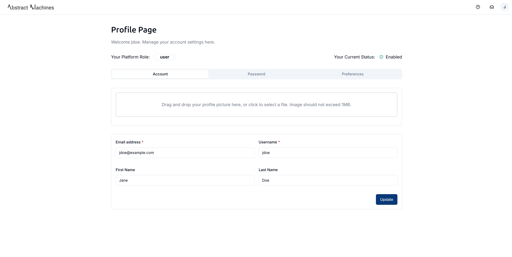
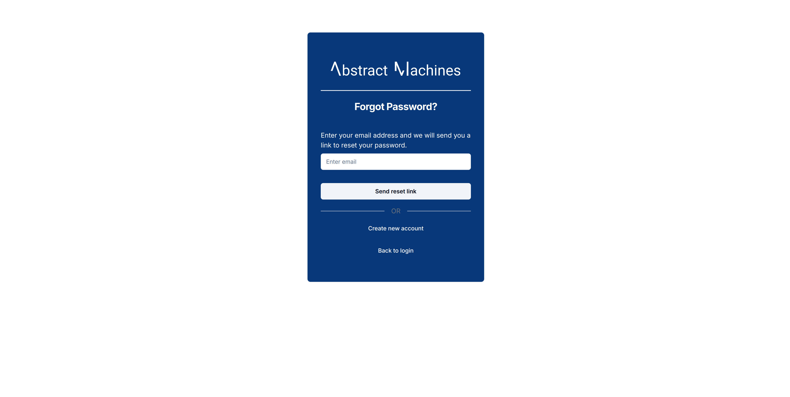

Users can be assigned multiple roles, granting them permissions over devices, domains, and channels within the platform.

### Log In

To access the platform, log in with your email and password.

### Sign Up

To create a new user with **standard permissions**, navigate to the **Register** page. The new user must provide:

- **First and last name**
- **A unique email address**
- **A username**

Once registered, the user will receive a unique authentication token and be redirected to the **Domains Homepage**, where they can create and manage multiple domains.

Tokens tend to expire after some time which will lead to the user being kicked out of the session. Do not be alarmed if this happens. Simply back log in through the Login page with the user's **username** or **email address** as well as password.

### User Profile

Each user has access to a **Profile Page**, where they can update their personal information, security settings, and preferences.

Clicking on the **User icon** at the bottom left when logged into a Domain or at the top right when not logged into any domain session opens a popover.

#### Standard User Menu

- **Profile**
- **Domains**
- **Logout**

Upon selecting the **Profile** option, users will see three main tabs:

- **Settings**
- **Password**
- **Preferences**

The first tab allows a user to update their names as well as upload a profile picture.

The second tab is for security purposes and allows a user to change their passwords. This is different from the `forgot password` functionality we went over. From here you simply have to input your current password which **MUST** pass the check, then add a new password and confirm that password.

> **Note:** After updating the password, the session will be terminated, requiring the user to log in again using the new credentials.

There is a preferences tab which allows the user to set their own **language** and **theme** settings.

Magistrala supports **English, German, and Serbian** languages and offers **four different themes** to choose from.

### Log Out

Finally, there is the logout option which kills the current session and logs the user out.
This does not result in deletion of the user but will just redirect you to the main l**Login Page**. Ensure any updated settings are saved before logging out.

If the session expires while on the **Domains Homepage** or within a domain, attempting any action may result in a **"Failed to perform authorization"** error. Logging out and back in will resolve this.

### Password Recovery

If a user forgets their password, they can use the **Forgot Password** link. This will direct them to a page where they enter their email address, and a reset link will be sent to their email.

> **Important:** To enable email notifications, ensure the **mailing functionality** is correctly configured in [Magistrala’s environment file](https://github.com/absmach/magistrala/blob/main/docker/.env#L199-#L206). This setup is crucial for password recovery and other email-based functionalities.

> Always ensure you have set up your email as discussed before to ensure that the email is received.

The reset password link should have a new token that they can click on.

This will immediately redirect the user to a **Reset Password** page where they will create a new password and confirm it. After a reset they can then be logged into the system with the new password.
