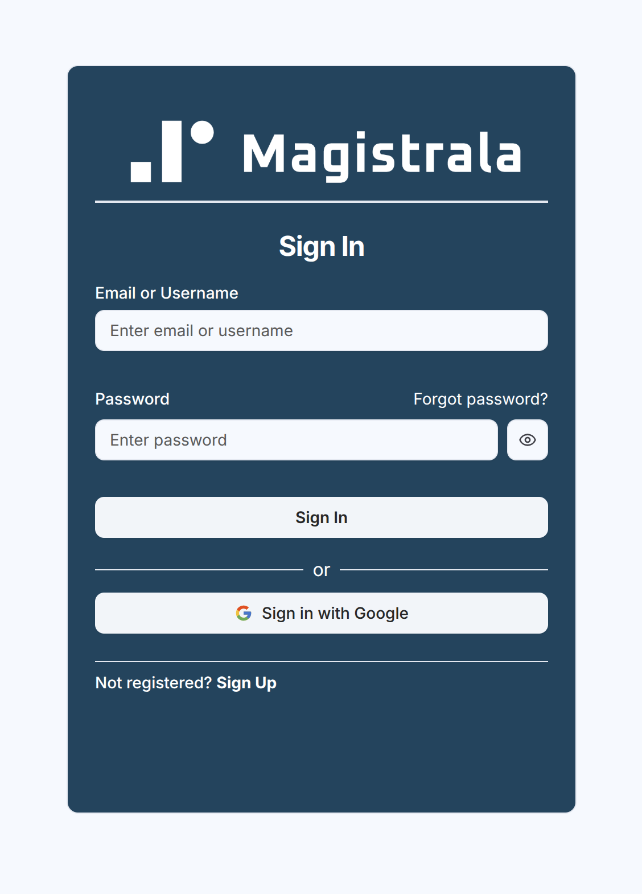

Users can be assigned multiple roles, granting them permissions over devices, domains, and channels within the platform.

## User Client Platform

### Logging In

To access the platform, log in with your email and password. For an initial login session, if no users have been created yet, use the default **Super Admin** credentials:

- **Email:** `admin@example.com`
- **Password:** `12345678`

Upon successful login, you will have **Super Admin** privileges, granting full control over the platform. As a **Super Admin**, you can access any user’s domain and manage **clients, channels, groups, and more**.

### Signing Up

To create a new user with **standard permissions**, navigate to the **Register** page. The new user must provide:

- **First and last name**
- **A unique email address**
- **A username**

Once registered, the user will receive a unique authentication token and be redirected to the **Domains Homepage**, where they can create and manage multiple domains.

Tokens tend to expire after some time which will lead to the user being kicked out of the session. Do not be alarmed if this happens. Simply back log in through the Login page with the user's **username** or **email address** as well as password.

### Password Recovery

If a user forgets their password, they can use the **Forgot Password** link. This will direct them to a page where they enter their email address, and a reset link will be sent.

> **Important:** To enable email notifications, ensure the **mailing functionality** is correctly configured in [Magistrala’s environment file](https://github.com/absmach/magistrala/blob/main/docker/.env#L199-#L206). This setup is crucial for password recovery and other email-based functionalities.

### User Profile

Each user has access to a **Profile Page**, where they can update their personal information, security settings, and preferences.

Clicking on the **User icon** at the bottom left when logged into a Domain or at the top right when not logged into any domain session opens a popover.

The profile menu options depend on the user’s role:

#### Standard User Menu

- **Profile**
- **Domains**
- **Logout**

#### Admin User Menu

- **Profile**
- **Domains**
- **Manage Users**
- **Platform Management**
- **Logout**

Upon selecting the **Profile** option, users will see three main tabs:

- **Settings**
- **Password**
- **Preferences**

The first tab allows a user to update their names as well as upload a profile picture.

The second tab is for security purposes and allows a user to change their passwords. This is different from the `forgot password` functionality we went over. From here you simply have to input your current password which **MUST** pass the check, then add a new password and confirm that password.

> **Note:** After updating the password, the session will be terminated, requiring the user to log in again using the new credentials.

There is a preferences tab which allows the user to set their own **language** and **theme** settings.

Magistrala supports **English, German, and Serbian** languages and offers **four different themes** to choose from.

### User Management

A **Super Admin** has extensive permissions beyond those of a regular user, including the ability to manage users.

Navigating to **Manage Users** leads to the **Users Table**, displaying all registered users.

To create a User:

- Click on the `+ Create User` button.
- A dialog box will appear with a form requiring a **name**, **email address**, and **password**, all marked with asterisks.
- Users can have tags that help identify or group them. Metadata may include the UI theme and preferred language.

Multiple users can also be created via _.CSV_ files added to the UI with the needed fields filled in as in the example provided in [samples](https://github.com/absmach/magistrala-ui/tree/main/samples).
An admin just has to click on the `+ Create Users` button which will bring up a dialog box that allows them to drag and drop the .csv file needed.

Once created, users can be updated and assigned to various entities. On the **View User** page:

- You can update the user's name, copy their ID, change their email address, metadata, and tags, or disable them.
- **Disabled** users remain in the database but are restricted in actions (e.g., cannot be added to a new domain).

Users assigned to a **domain** inherit permissions based on their assigned role:

- **Admin Role** → Have full control over domain entities.
- **Member Role** → Have limited to viewing domain entities.

### Platform Management

This will lead you to a page with all the **Users**, **Domains** and **Billing Plans** present in the system.

As Admin level User, you can perform CRUD operations and manage the Domains and Billing Plans in the system. More details will be covered in their respective sections.

### Logging Out

Finally, there is the logout option which kills the current session and logs the user out.
This does not result in deletion of the user but will just redirect you to the main l**Login Page**. Ensure any updated settings are saved before logging out.

If the session expires while on the **Domains Homepage** or within a domain, attempting any action may result in a **"Failed to perform authorization"** error. Logging out and back in will resolve this.

### Forgot Password

Should you have forgotten your password when logging in, you can use the `forgot password` link that will lead you to this page where you enter your email and a reset password link is sent to your email.

> Always ensure you have set up your email as discussed before to ensure that the email is received.

The reset password link should have a new token that you can click on.

This will immediately redirect you to a **Reset Password** page where you will create a new password and confirm it. After a reset you can then be logged into the system with your new password.

## Domain Introduction

Upon logging in, users are redirected to the **Domain Selection Page**.

A **Domain** is a workspace that contains **Clients**, **Channels**, **Groups**, **Dashboards** as well as **Roles** and **Rules Engine** Services. A user can create as many domains as they please. A **Super Admin** has access to all domains present in the system. But a **User** must be a member or creator of a domain to log into it.

Click on the `+ Create` button on the top right to create a new domain. Since multiple domains can have the same name, you must add an **alias** which will be a unique descriptor for the domain.

Once you create a domain, you are given **Administrator** permission over the domain. You are able to perform all actions available over the domain and all the entities provisioned inside the domain. You can also assign or invite members to the domain with various levels of permissions.

We will delve deeper into Domains in another section. For now you need to be able to log into a Domain to move on to **Groups**.

## **Groups Service**

Once logged in, you will be directed to the **Homepage** where you can view all the available entities in the domain.

On the sidebar navigation, click on **Groups** under the _Client Management_ section to be redirected to the groups page.

**Groups** are multiples of Users. By itself, the service can have domain members assigned to groups. These members will have all the roles and permissions that the group has over any other entity present in the group. This allows for ease of management of a multitude of Users making it more efficient.

A group has to be created once a user logs into a domain and it will be assigned the domains ID and will be restricted to that domain.
A user cannot share the group across domains.

### Creating a Group

To create a group, click on the `+ Create` button present on the top-left corner of the page. This will open a popover with all the required fields for a new group.

There is an option to add a parent to the group. This creates a hierachy. Permissions and roles can be shared down this heirachy.

You can also create multiple groups at the same time using a _.CSV_ file which has all the required fields correctly filled in. Click on the `Upload` button and add your csv file. Magistrala provides samples as shown on the popover.

### Viewing a Group

After creating a group, it will show up on the page as the first group created.

While on the View Group Page, you can edit the group name by clicking on the pencil Icon and saving your changes. The same can be done for the group description as well as Metadata.

> The family tree section shows a group's parent-child relationship:

- A group can have a **single parent**, placing it in a hierarchical level.
- A group without a parent is a **Level 1 group**, while one with a parent is **Level 2**.
- A group can have multiple child groups.

When using parent or child groups, ensure that the referenced groups already exist to avoid errors.

A group can alsp be diabled or enabled by anyone with `edit` privileges. This is just the change of state from 1 to 0 in the case of the disabling.

### Assigning Users to Groups

A user can assign and unassign users to a specific group and provide them with policies over the entities the groups has control over.
This just allows for a more streamlined approach to more than one user.
Members of the domain with edit, member and admin permissions usually are already assigned to the group. We will discuss more on these roles and policies in the **Roles** section later on.

A user can be a member of more than one group with different policies over each allowing an admin greater control over the users they have.

### Assigning Roles to Groups

A user can assign Roles created in the domain to certain groups. This can be done in the third tab of the groups page. These roles can vary depending on which role actions the user desires the group to have.

By default, the admin role is always present in the group for the admin user who created the group as well as the Super Admin.

You can create a new role and assign it to the group as well as assign a member to it upon creation.

This new role will be specific to the group entities and not visible outside the group.

We will discuss more on roles in the **Roles** section later on.

### Assigning Clients to Groups

Clients present in the domain can be assigned to the group.

A user can also create clients specific to the group while on the fourth tab of the view group page. Any group member can then have permissions over the client as specified by their roles.

### Assigning Channels to Groups

A user can create a channel or channels specific to the group while on the view group channels page. Any group member can then be specified to have certain roles over the channel.

### Audit Logs

Audit logs track all **group events**, from **creation** to **updates** and **disabling**.
