**Widgets** are the building blocks of a dashboard, allowing users to visualize and interact with their IoT data.
Each widget provides a specific way to display or control the data flowing from connected devices.
Whether you're monitoring live sensor readings or interacting with devices remotely, widgets offer the flexibility to suit your specific needs.
We currently do not support real time monitoring but that is under the works and will be included in later installments.

Magistrala offers a variety of widgets, including charts, data cards, and control elements:

- **Timeseries Charts**:
  - Line Chart
  - Bar Chart
  - Area Chart
  - Pie Chart
- **Cards**:
  - Value Card
  - Count Card
  - Table Card
- **Control Elements**:
  - Switch
  - Slider
- **Gauges**:
  - Gauge Chart
- **Maps**:
  - Route Map
  - Marker Map

Each of these widgets can be customized and configured to display data in the most meaningful way for your use case.

To use widgets effectively, particularly timeseries charts, you need to have connected entities that are actively sending data.
A guide to how to connect and send messages is provided on [getting-started.md].
Widgets rely on messages sent from devices in the following format:

```json
{
  "publisher": "866783d4-b8f9-477a-9ff5-637891c25a3e",
  "protocol": "coap",
  "name": "demovoltage",
  "unit": "V",
  "time": "2024-07-30 20:33:39",
  "value": 6679038674907747000
}
```

## Creating Widgets

Much of this section is covered in the [dashboards.md] file but we will now go into each individual chart.

### **1. Line Chart**

To create a Line Chart, first ensure that the dashboard is in **Edit Mode**.
Click on the '+ Add Widget' button, which will open a dialog box displaying all the available widgets.
Select the **Line Chart** option from the list.


This will open the **Create Line Chart** dialog, where you can configure the chart's settings and data sources. Let’s start by setting up a single data source.

1. **Value Name**: Enter the name of the value that will be used to fetch the messages.
2. **Channel**: Choose the channel connected to the device you want to track.
3. **Thing**: Select the thing (device/entity) connected to the specified channel.
4. **Label**: Provide a label to track each data source clearly on the chart.
5. **Line Color**: Use the color picker to choose the color for the line.


After configuring the data source, you can define a **Time Window** by specifying the "From" and "To" dates to constrain the data within a specific time interval.

In the **Settings** tab, you can also adjust the **Line Width** to set the thickness of the line, depending on your visual preference.


Once you're satisfied with your settings, click the **Create** button to save the Line Chart widget.
This will close the dialog and add the new Line Chart to your dashboard.


You can edit the chart at any time by clicking the **Pencil Icon** on the widget. This will open a settings sheet on the right, where you can modify the chart’s data sources, labels, intervals, and title.


At this stage, you can also edit the labels, intervals, and chart title:


Clicking on Update button will save the changes and adjust the chart to match the new settings.
A confirmation message (toast notification) will appear to confirm the update has been applied.


This data can be further manipulated using the **Time Window** settings.
We can restrict the data shown to a specific interval for example an hour as shown in these settings:


This will adjust the chart to display data within the defined time frame, ensuring the final data point is at or before the specified _To_ date.


Additionally, you can apply **Aggregation** to the data points. Aggregation requires a "From" value, a "To" value, and an interval. These settings help structure the query to the database for aggregated data.


In the example above, the chart is set to show the **Maximum** value over 10-minute intervals within a 100-minute time window.

The resulting chart will look like this:


Aggregation options include:

- **Maximum**
- **Minimum**
- **Sum**
- **Count**
- **Average**

### **2. Bar Chart**

Much like the Line Chart the Bar Chart has a similar Timeseries form in its dialogbox.
To create a Bar Chart, first ensure that the dashboard is in **Edit Mode**.
Click on the '+ Add Widget' button, which will open a dialog box displaying all the available widgets.
Select the **Bar Chart** option from the list.

This will open the **Create Bar Chart** dialog, where you can configure the chart’s settings and data sources just as we do with the line Chart.
The inputs with asteriks are important and must be filled in before clicking 'Create'


Once the data sources are set, you can define a **Time Window** by specifying the "From" and "To" dates, which will limit the data displayed to a specific time interval.
In the **Settings** tab, you can further customize the chart by adjusting its appearance, including the Update Interval and other relevant properties.
After configuring your chart, click the **Create** button to save the Bar Chart widget.
This will close the dialog and add the Bar Chart to your dashboard.


You can edit an existing Bar Chart by clicking the **Pencil Icon** on the top-right corner of the chart. This will open an edit sheet to the right, where you can modify the data sources, labels, time window, and other settings.

1. **Add Data Sources**: You can add more data sources by clicking the **Add Source** button and providing additional channels, things, and labels.
2. **Delete Data Sources**: To remove a data source, click on the **Trash Icon** next to the specific data source you wish to delete.


At this stage, you can also modify the chart title, labels, and intervals to suit your requirements.
Once you're done with the changes, click the **Update** button to save the modifications.


You can further filter the data shown in the chart using the **Time Window** settings, which allow you to restrict the data to a specific time range.

For example, selecting a time window from 17:30 to 19:30 will constrain the data to that range of two hours.
Additionally, you can apply **Aggregation** to the data points.

These settings help group the data and allow you to display more meaningful summaries.
For instance, applying aggregation with an interval of 10 minutes and selecting "Minimum" will display the lowest value recorded for each 10-minute interval over a two hour time window.


After applying these settings, the resulting chart will show aggregated values based on the specified criteria.


With the ability to add, edit, and delete data sources, and fine-tune time windows and aggregation, Bar Charts offer a versatile way to visualize your data on the dashboard.

### 3. **Area Chart**

Creating an Area Chart follows a process similar to other timeseries charts, but it offers a visually distinct way to represent data trends over time.
To create an Area Chart, ensure your dashboard is in **Edit Mode**.
Click the '+ Add Widget' button, then select the **Area Chart** option from the widget list.
This will open the **Create Area Chart** dialog, where you can configure your settings and data sources.

#### Configuring the Area Chart

1. **Value Name**: Enter the name of the value you wish to visualize, such as voltage or temperature.
2. **Channel**: Select the channel that provides the data you want to plot.
3. **Thing**: Choose the entity or device connected to the channel.
4. **Label**: Provide a meaningful label to differentiate each data source on the chart.
5. **Area Color**: Pick a color for the filled area of the chart using the color picker.

You can also add multiple data sources by clicking the **Add Source** button.


Once the data sources are configured, you can define a **Time Window** by specifying the "From" and "To" dates, which will constrain the data shown to the specified time period.
In the **Settings** tab, you can adjust the **Update Interval** (how often the chart refreshes) and other chart appearance options.
After configuring everything, click the **Create** button to add the Area Chart to your dashboard.


You can edit your Area Chart anytime by clicking the **Pencil Icon** on the top-right corner of the widget. This will open the edit sheet on the right, where you can modify data sources, the chart title, and adjust settings like the time window.

1. **Adding Data Sources**: Click on the **Add Source** button to include additional data streams.
2. **Modifying Time Window**: If you wish to change the time range for the chart, specify the "From" and "To" dates to focus the data.
3. **Aggregation**: Apply data aggregation to summarize the data points. For example, you can select **Sum**, **Average**, **Maximum**, **Minimum**, or **Count** to see aggregated values over defined intervals.

For instance you can add two more datasources to the Area Chart.


Once you've made the necessary changes, click the **Update** button to save and apply the new settings. You'll see the chart automatically refresh with the updated data or appearance.


In many cases, you may want to summarize data by aggregating it over time intervals. For example, setting the **Aggregation Interval** to 10 minutes (600 seconds) and choosing the **Average** aggregation type will display the mean values over each 10-minute period for a 2 hour time window.


The result will be an Area Chart that shows the mean value in each time interval, providing an insightful view of your data trends.


With Area Charts, you can easily visualize changes in data over time, allowing you to track trends and patterns with a clean, filled-in graphical representation.
This chart is particularly useful for comparing cumulative values and emphasizing the overall volume of data.

### **4. Pie Chart**

Pie Charts offer a simple yet effective way to compare different data points by visualizing them as proportions of a whole.
Unlike other timeseries charts, Pie Charts only display the **latest value** from each data source, making them ideal for showing the most recent data from multiple sources in a comparative manner.

To create a Pie Chart, ensure that your dashboard is in **Edit Mode**.
Click the '+ Add Widget' button, and from the list of available widgets, select **Pie Chart**.

This opens the **Create Pie Chart** dialog, where you will configure the chart’s data sources and settings.

After filling in the required fields of valueName and dataSources, you can add a unique title and adjust the refresh interval.

These are the required fields to configure the Pie Chart;

1. **Value Name**: Enter the name of the value that will be displayed, such as voltage or temperature.
2. **Channel**: Select the channel that provides the data. Ensure to select more than one channel by clicking "Add Source"
3. **Thing**: Choose the entity or device connected to the respective channels.
4. **Label**: Provide a label for each data source, as it will help distinguish the different segments of the pie.
5. **Color**: Select a color for each data source slice in the Pie Chart.


Once you have configured the data sources, you can define a **Time Window** by specifying the "From" and "To" dates.
The Pie Chart will display the latest message within this time window, locking onto the last message received during the specified period.
In the **Settings** tab, you can adjust the **Update Interval** to determine how often the chart refreshes with new data.

Once everything is set, click the **Create** button to save the Pie Chart widget and add it to your dashboard.


To edit a Pie Chart, click the **Pencil Icon** on the top-right corner of the widget.
This will open the edit sheet on the right, where you can adjust the data sources, labels, colors, time window, and other settings.

1. **Adding More Data Sources**: You can add additional data sources to compare more metrics.
2. **Modifying Time Window**: Adjust the "From" and "To" dates to capture the desired time period for the latest values.
3. **Delete a Data Source**: Use the **Trash Icon** to remove any data source.


After making the necessary changes, click the **Update** button to apply the modifications.
The chart will refresh, displaying the updated data and settings.


Pie Charts also support **Aggregation**, allowing you to show a summary value (such as **Maximum**, **Minimum**, **Sum**, **Count**, or **Average**) from the data in each time window.
However, unlike other timeseries charts, you don’t need to specify an interval—the time window itself defines the aggregation range, and the chart will only display the aggregated value for each data source.


For example, setting the aggregation to **Maximum** will display the highest value of each data source within the specified time window, helping you understand the overall distribution of data across different sources.


#### Customizing Pie Charts

- **Multiple Data Sources**: To get the most out of Pie Charts, it’s recommended to add multiple data sources. This way, you can easily compare how different data points relate to each other.
- **Color Customization**: Each slice in the pie chart represents a different data source, and the color picker allows you to easily distinguish between them.

With the ability to lock onto the latest message in a time window and aggregate data over specific periods, Pie Charts are a powerful tool for comparing real-time or recent data from multiple devices or channels in a visually appealing format.

### **5. Value Card**

A **Value Card** displays the latest value of a message from a connected channel, providing a quick snapshot of real-time data.
Unlike timeseries charts, Value Cards do not need a time interval because they only show the most recent message from the selected data source.

To create a Value Card, ensure your dashboard is in **Edit Mode**.
Click the '+ Add Widget' button, then select **Value Card** from the list of available widgets.

This will open the **Create Value Card** dialog, where you can configure the card's data source and appearance.

#### Configuring the Value Card

1. **Channel**: Select the channel from which the card will pull data.
2. **Thing**: Choose the connected device (thing) that corresponds to the channel.
3. **Value Name**: Enter the value name that you wish to display on the card (e.g., demovoltage).
4. **Update Interval**: Set the interval for how often the card should refresh to show the latest message.
5. **Title**: Provide a title for your value card. This will be displayed at the top of the widget.
6. **Unit**: Specify the unit of measurement (e.g., V for volts, °C for temperature).


7. **Icon**: Select an icon that visually represents the data displayed. You can choose from a list of icons to match the context of the value.

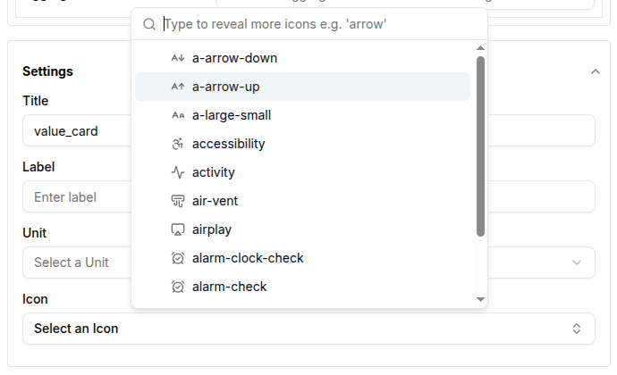

Once all the necessary fields are completed, click the **Create** button to add the Value Card to your dashboard.
The card will immediately display the latest value from the channel, along with the associated unit and icon.


You can edit a Value Card by clicking the **Pencil Icon** in the top-right corner of the widget.
This will open a sheet on the right, allowing you to adjust the data source, title, icon, and other settings.

1. **Data Source**: Modify the channel, thing, or value name if needed.
2. **Update Interval**: Adjust how often the card should refresh with the latest data.
3. **Title**: Change the title of the value card to reflect the new information.
4. **Unit**: Update the unit if the data type changes (e.g., from volts to amps).
5. **Icon**: Select a new icon that matches the updated data context.


Once the updates are made, click **Update** to save the changes.
The card will refresh with the new configuration, showing the updated data and icon.


#### Customizing Value Cards

- **Icons**: The ability to select an icon is crucial for visually representing the type of data displayed. For example, you can choose an "activity" icon for voltage or a "thermometer" icon for temperature.
- **Display**: The value card displays the value, unit, and the last update time, ensuring that users can quickly grasp the current status of the connected device or channel.

With Value Cards, you can effectively monitor the latest value of a specific metric, making them ideal for real-time overviews of critical data from connected devices.

### **6. Gauges**

Gauges are essential widgets for visualizing the latest value of a message from a connected **Thing** or **Channel**.
They provide an intuitive way to track metrics like voltage, speed, or temperature.

  

Magistrala offers different types of gauges, including:

- **Simple Gauge**
- **Temperature Gauge**
- **Speed Gauge**

Each gauge widget can be configured to show specific values based on the connected devices. Let’s explore the creation of these gauges.

---

### 6.1 Simple Gauge

The **Simple Gauge** widget displays the latest value from a selected data source, like voltage, pressure, or other metrics.
The gauge is customizable, allowing you to set the minimum and maximum value range, update intervals, and title.

#### **Steps to Create a Simple Gauge**

1. Ensure the dashboard is in **Edit Mode**.
2. Click the **+ Add Widget** button and select **Simple Gauge** from the widget list. This will open the gauge configuration dialog.

  
3. **Gauge Type**: Select **Simple Gauge** from the dropdown.
4. **Channel**: Choose the **Channel** that will provide the data for the gauge.
5. **Thing**: Select the **Thing** (device/entity) that is connected to the Channel whose data will be visualized.
6. **Value Name**: Specify the name of the value that will be used to fetch messages (e.g., `demovoltage`).

  
**Settings Section**
7. **Minimum Value**: Set the minimum value for the gauge, which could represent the lower limit of the metric you're tracking (e.g., `50000` for voltage).
8. **Maximum Value**: Set the maximum value for the gauge (e.g., `100000` for voltage).
9. **Update Interval**: Specify how frequently the gauge should update its value (in seconds). For instance, an interval of `600` seconds means the gauge will update every 10 minutes.
10. **Title**: Enter a descriptive title for the gauge (e.g., "Monical Voltage").
11. **Unit**: Select the unit needed for the simple gauge. It will show up on the gauge chart. There is a list of Units you can choose from for simplegauge:
[comment] add the list of units here

  
12. After configuring the gauge, click **Create** to save and add the widget to your dashboard.

Once the widget is added, the gauge will immediately begin displaying the latest value based on the settings you've applied.

  

You can edit the gauge later by clicking the **Pencil Icon** on the widget, allowing you to adjust the data sources, value name, title, or settings as needed.

  

---

### 6.2 Temperature Gauge

The **Temperature Gauge** widget functions similarly to the Simple Gauge but is tailored for temperature values. It displays the latest temperature data from a connected device.

#### **Steps to Create a Temperature Gauge**

1. Start by putting the dashboard in **Edit Mode**.
2. Click **+ Add Widget** and select **Temperature Gauge** from the list. This will open the temperature gauge configuration dialog.

  
3. **Gauge Type**: Select **Temperature Gauge** from the dropdown.
4. **Channel**: Choose the **Channel** that will provide the temperature data.
5. **Thing**: Select the **Thing** (device) connected to the channel.
6. **Value Name**: Enter the value name for the temperature data that will be used to fetch messages(e.g., `tempValue`).

  
**Settings Section**
7. **Minimum Value**: Set the minimum value for the gauge (e.g., `0` for temperatures in degrees Celsius).
8. **Maximum Value**: Set the maximum value (e.g., `20000` for temperatures in degrees Celsius).
9. **Update Interval**: Define the update frequency (in seconds), such as `60` seconds for a 5-minute update cycle.
10. **Title**: Provide a title for the temperature gauge (e.g., "Monical Temperature Gauge").
11. **Unit**: Select the unit needed for the temperature gauge. It will show up on the gauge chart. The options available are Degrees Celcius, Kelvin and Farenheight as shown below:

  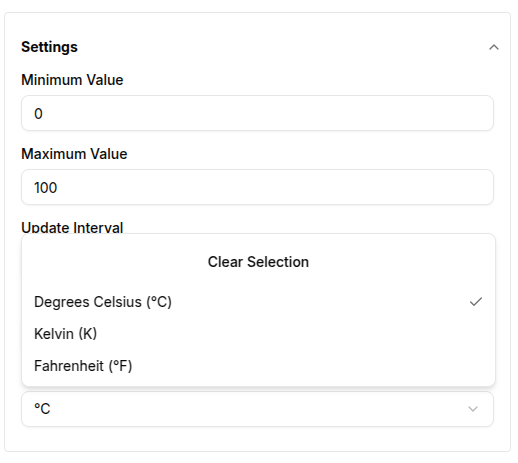
12. Click **Create** to add the Temperature Gauge to your dashboard. The gauge will immediately start reflecting the latest temperature readings.

  

You can modify the gauge by clicking the **Pencil Icon** on the widget, allowing you to adjust the data source, title, and value ranges.

---

### 6.3 Speed Gauge

The **Speed Gauge** widget tracks speed or velocity values from connected devices. It functions similarly to the Simple and Temperature Gauges, but the units and appearance are tailored for speed data.

#### **Steps to Create a Speed Gauge**

1. Ensure the dashboard is in **Edit Mode**.
2. Click **+ Add Widget** and select **Speed Gauge** from the list of available widgets.

  
3. **Gauge Type**: Select **Speed Gauge**.
4. **Channel**: Select the **Channel** providing the speed data.
5. **Thing**: Choose the connected **Thing** (device).
6. **Value Name**: Enter the name of the value that corresponds to speed (e.g., `speedValue`).

  
**Settings Section**
7. **Minimum Value**: Set the minimum speed value (e.g., `0`).
8. **Maximum Value**: Set the maximum speed value (e.g., `10000` for kilometers per hour).
9. **Update Interval**: Set how frequently the gauge should refresh (e.g., every `60` seconds).
10. **Title**: Provide a title for the speed gauge (e.g., "Monical Speed Gauge").
11. **Unit**: Select the unit needed for the simple gauge. It will show up on the gauge chart. There is a list of Units you can choose from for speed gauge.

   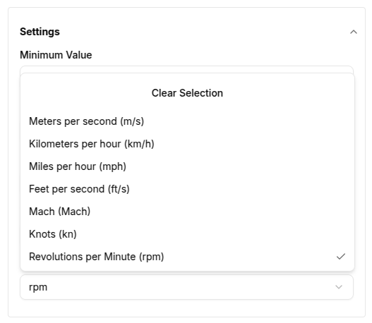
11. Click **Create** to save the Speed Gauge widget. The gauge will then start showing the latest speed data.

   

---

### **Conclusion**

Gauges provide a highly visual, intuitive way to track live data for a variety of metrics.
Whether you're monitoring voltage, temperature, or speed, these widgets offer flexibility in displaying the most important data from your connected IoT devices.

  

Each gauge can be customized with specific value ranges, update intervals, and labels, making them adaptable to any use case.
You can also edit existing gauges to adjust settings as your monitoring needs evolve.

### **7. Table Card**

A **Table Card** displays a list of entities (such as devices, members, or groups) within a domain, showing both enabled and disabled entities.
It also includes pagination to help manage large lists effectively.

To create a Table Card, ensure your dashboard is in **Edit Mode**.
Click the **+ Add Widget** button and select **Table Card** from the list of available widgets.

  

This will open the **Create Table Card** dialog, where you can configure the card's data source and appearance.

#### Configuring the Table Card

1. **Entity Type**: Select the type of entity you wish to display in the table. The available options include:
   - **Thing** (device)
   - **Channel**
   - **Member**- the users assigned to the currently logged in domain.
   - **Group**

   

2. **Entity Status**: Choose whether to display only enabled entities, disabled entities, or both.
3. **Tag**: Optionally, you can filter the entities shown by specifying a tag. Only entities with the given tag will be displayed.
4. **Update Interval**: Set the interval for how often the table should refresh to show the latest data. For example, an interval of `60` seconds will refresh the table every minute.
5. **Title**: Provide a title for your table card. This will be displayed at the top of the widget.

   

Once all the necessary fields are completed, click the **Create** button to add the Table Card to your dashboard.

The table card will immediately display the list of entities based on the selected data source and filters.

The table will include columns like:

- **Name**: The name of the entity (e.g., device name).
- **Status**: Whether the entity is enabled or disabled.
- **Created At**: The timestamp of when the entity was created.

   

The card also includes pagination at the bottom, allowing you to navigate through multiple pages of entities.

You can edit a Table Card by clicking the **Pencil Icon** in the top-right corner of the widget.
This will open a sheet on the right, allowing you to adjust the data source, entity status, tag, and other settings.

#### Editing the Table Card

1. **Data Source**: Modify the **Entity Type**, **Status**, or **Tag** to change the entities displayed in the table.
2. **Update Interval**: Adjust how often the table should refresh with the latest data.
3. **Title**: Update the title of the table card to reflect any new data or focus.

   

Once the updates are made, click **Update** to save the changes.

The table card will refresh with the new data and settings.

   

#### Customizing Table Cards

- **Entity Types**: Table Cards are versatile because they can display a variety of entities (Things, Channels, Members, Groups). Each selection offers relevant insights into your domain's structure and activity.

  
  

- **Tags**: By applying tags, you can filter the list to show specific groups of entities, which is useful for managing large numbers of devices or users.
- **Pagination**: For larger datasets, the pagination feature allows you to control the number of rows displayed per page, ensuring better performance and ease of navigation.

  

With Table Cards, you can effectively monitor and manage lists of entities within a domain, making them ideal for reviewing the status of devices, members, or groups in an organized and customizable format.

### **8. Count Card**

A **Count Card** displays the total number of entities (such as devices, channels, members, or groups) within a domain.
It provides a quick snapshot of how many entities are currently available, based on the selected entity type and status.

To create a Count Card, ensure your dashboard is in **Edit Mode**.
Click the **+ Add Widget** button and select **Count Card** from the list of available widgets.


This will open the **Create Count Card** dialog, where you can configure the card's data source and appearance.


#### Configuring the Count Card

1. **Entity Type**: Select the type of entity you wish to count in the card. The available options include:
   - **Thing** (device)
   - **Channel**
   - **Member**
   - **Group**

   

2. **Entity Status**: Choose whether to count only enabled entities, disabled entities, or both.
3. **Tag**: Optionally, you can filter the entities shown by specifying a tag. Only entities with the given tag will be counted.
4. **Update Interval**: Set the interval for how often the card should refresh to show the latest count. For example, an interval of `60` seconds will refresh the card every minute.
5. **Title**: Provide a title for your count card. This will be displayed at the top of the widget.

   

Once all the necessary fields are completed, click the **Create** button to add the Count Card to your dashboard.

The card will immediately display the total count of entities based on the selected data source and filters. The card will also display:

- **Status**: Whether the entities counted are enabled or disabled.
- **Tag**: If you specified a tag, it will display the tag value.

   

You can edit a Count Card by clicking the **Pencil Icon** in the top-right corner of the widget. This will open a sheet on the right, allowing you to adjust the data source, entity status, tag, and other settings.

#### Editing the Count Card

1. **Data Source**: Modify the **Entity Type**, **Status**, or **Tag** to change the entities being counted.
2. **Update Interval**: Adjust how often the card should refresh with the latest count.
3. **Title**: Update the title of the count card to reflect any new data or focus.

  

Once the updates are made, click **Update** to save the changes. The count card will refresh with the new data and settings.

  

#### Customizing Count Cards

Count Cards are versatile and can be customized to suit your needs. You can easily change the title, status, tags, and icons displayed on the card. The image below highlights the key customizable features:

   

1. **Changing Icons**: Each entity type can have its own icon, visually representing the type of entity being counted (e.g., a device icon for "Things").
2. **Entity Status**: Displays the status (Enabled/Disabled) of the entities.
3. **Deleting a Card**: You can delete a count card by clicking the **Trash Icon**. This will bring a popup asking for confirmation.
4. **Popup**: Click `Delete` to confirm that you'd like to delete the chart.
5. **Titles**: Shows the title of the count card, which can be customized for clarity.

With Count Cards, you can effectively monitor the total number of devices, channels, members, or groups in your domain, making them ideal for quick overviews of critical metrics.

### **9. Marker Map**

**Marker Maps** are used to visualize the location of entities (such as devices or channels) on a map.
This makes Marker Maps useful for tracking the geographical locations of various IoT assets on a visual interface.

Marker Maps work by fetching latitude and longitude data from the entity metadata.
A typical metadata entry for an entity’s location might look like this:

```json
{
  "location": {
    "latitude": 27.181212503119802,
    "longitude": 78.04195101133526
  }
}
```

These coordinates are then used to place a marker on the map. Users can add multiple data sources, such as different devices or channels, and visualize them on the same map.

#### Creating a Marker Map

To create a Marker Map, ensure the dashboard is in **Edit Mode**.
Click the **+ Add Widget** button, then select **Marker Map** from the list of available widgets.

This will open the **Create Marker Map** dialog, where you can configure the data sources and appearance of the map.

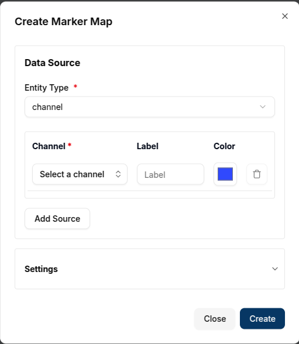

#### Configuring the Marker Map

1. **Entity Type**: Choose the type of entity whose location data you want to visualize. Available options include:
   - **Thing** (device)
   - **Channel**
   - **Group**

   

2. **Channel**: Select the specific entity whose location data will be displayed. Since we have worked with things/ devices a lot of times, we shall plot a channel this time. This channel already has its metadata configured.
3. **Label**: Provide a label for the marker, which will help identify it on the map.
4. **Color**: Choose a color for the marker to distinguish it from other markers.
5. **Add Source**: You can add multiple data sources (entities) to the map by clicking **Add Source**.
6. **Delete Source**: You can delete a Data Source by clicking on the `Trash Icon` next to the Data Source.

   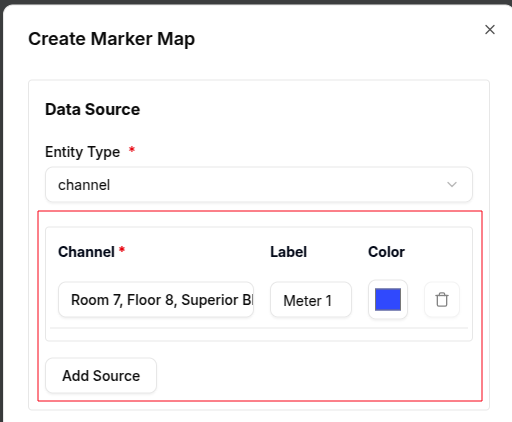

**Settings Section**
6. **Title**: Set a title for the map (e.g., "Marker Map"). This title will appear at the top of the map.
7. **Latitude Key**: Specify the metadata key that contains the latitude value. By default, it is set to `latitude`, but you can modify it if your metadata uses a different key.
8. **Longitude Key**: Similarly, set the metadata key for the longitude. The default value is `longitude`.

  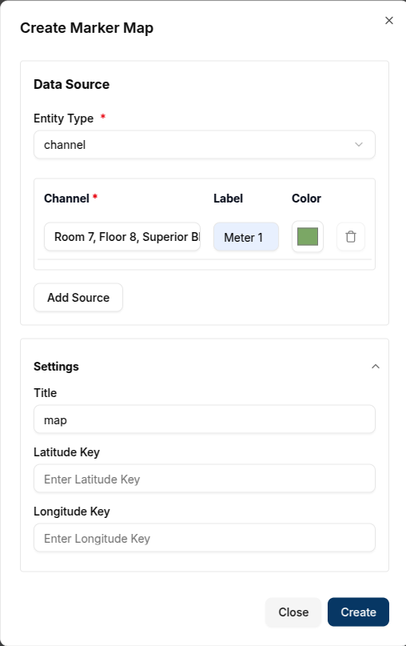

Once all required fields are completed, click the **Create** button to add the Marker Map to your dashboard.

After creating the Marker Map, it will automatically center on the specified locations based on the metadata.

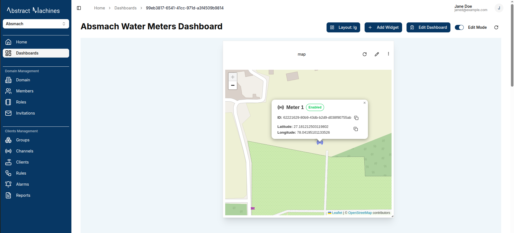

Each marker on the map has an interactive popup that provides more information about the entity.
Clicking on a marker will open a popup with the entity details, as shown below:

- **Entity Name**: This is the name of the device or channel or group with a small icon dependent on the entity type.
- **Status**: This shows the state of the entity which can be **enabled/disabled**
- **Entity ID**: This is the unique identifier for the entity. It can also be copied onto a clipboard when yo click on the copy icon next to it.
- **Latitude and Longitude**: The exact coordinates of the entity’s location, which can be copied to the clipboard.

   

#### Editing a Marker Map

You can edit the Marker Map by clicking the **Pencil Icon** at the top-right corner of the map widget. This will open the **Update Marker Map** dialog, allowing you to adjust the data sources, labels, colors, and other settings.

1. **Add or Delete Data Sources**: Add additional entities to the map or remove existing ones by clicking the **Add Source** or **Trash Icon**, respectively.
2. **Modify Settings**: You can update the **Latitude Key**, **Longitude Key**, and **Title** to better reflect the data being displayed.

   

Once you've made your changes, click **Update** to apply the modifications. The updated map will display the new locations or modified settings.

   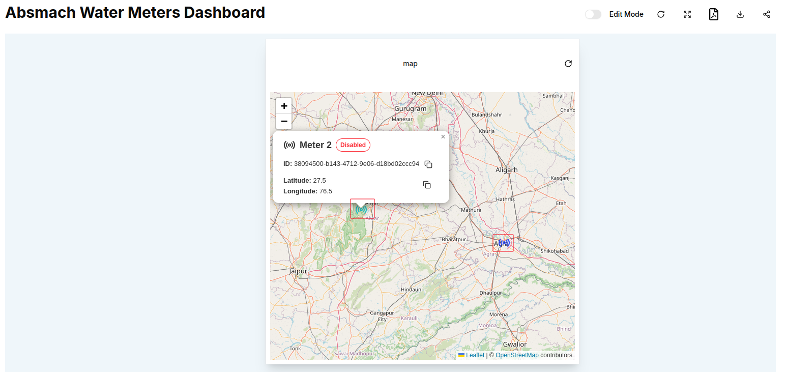

#### Conclusion

Marker Maps provide an intuitive way to visualize the physical locations of your IoT devices or channels on a dashboard.
The flexibility to add multiple data sources, customize markers, and retrieve position data from metadata or messages ensures that this widget is highly adaptable to various use cases.
By integrating real-time location data, Marker Maps enable users to track and monitor their assets effectively.

***10. Route Map**

**Route Maps** display the path or movement of a device or entity based on the location messages sent over time.
Unlike Marker Maps, which rely on metadata, Route Maps depend on message data from a connected channel-thing pair.
The messages contain latitude and longitude values that are used to trace the route on the map.
This feature is particularly useful for tracking the movement of devices over time.

#### How Route Maps Work

Route Maps visualize location data by retrieving it from messages sent through a channel.
We already went through sending messages in [getting-started](getting-started.md).
Navigate to the messages tab of a channel which already has connected things.
For RouteMap it is crucial to  use `location` as the Value name. Ensure the Value type is **`string`**.
The message should have the location data in the following format (as a string):

`{"latitude":-1.206367, "longitude":36.905012}`

  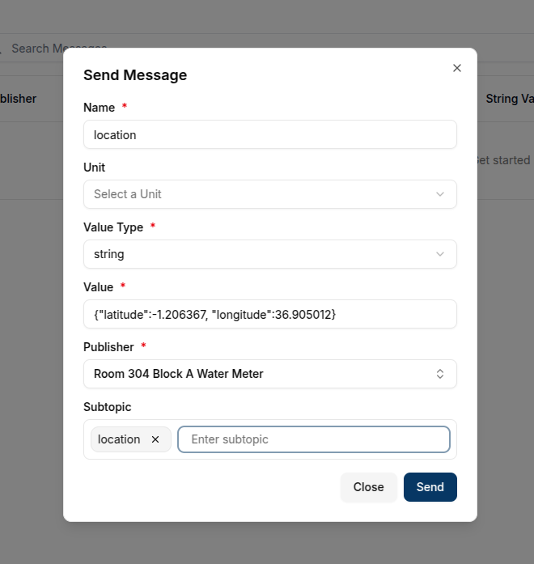

These location values will be used to plot the device's movement on the map.
The latest message will indicate the current location, and previous messages will form the route path.

#### Creating a Route Map

To create a Route Map, ensure the dashboard is in **Edit Mode**. Click the **+ Add Widget** button and select **Route Map** from the list of available widgets.

This will open the **Create Route Map** dialog, where you can configure the data sources and appearance of the map.

  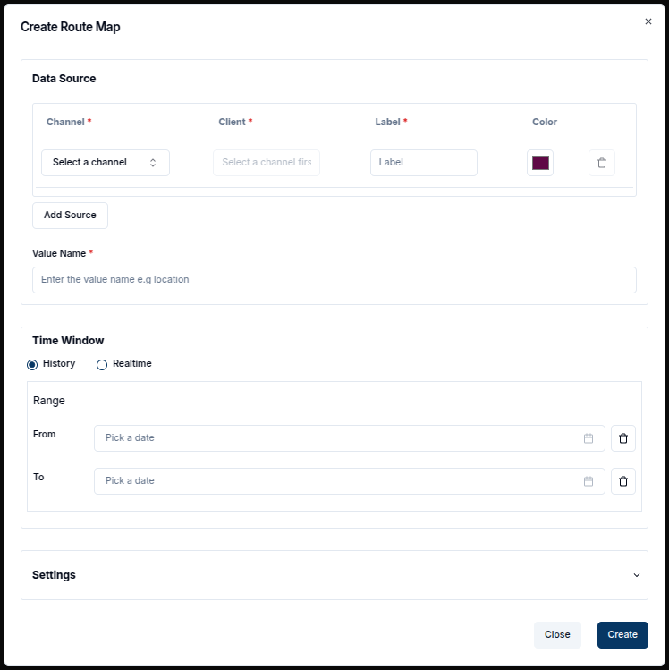

#### Configuring the Route Map

1. **Value Name**: Enter the name of the value that will contain the location data. This name should match the key in the message where the location information is stored.
2. **Channel**: Select the channel that will provide the location messages.
3. **Thing**: Choose the connected device (thing) associated with the selected channel.
4. **Label**: Provide a label for the route, which will help identify it on the map.
5. **Color**: Choose a color to represent the route line on the map.
6. **Add Source**: You can add multiple data sources (things or channels) by clicking **Add Source**.
7. **Remove Source**: To remove a data source, click the **Trash Icon** next to the specific entry.

  

#### Settings Section

1. **Time Window**: In the advanced settings, you can define a time range (`From Date` and `To Date`). This setting will limit the messages displayed on the map to a specific time interval. The route will display all the messages sent within this window, with the pointer indicating the last message before the `To Date` timestamp.

2. **Update Interval**: Set how frequently the map should refresh to display new messages.

3. **Title**: Set a title for the map (e.g., "Device Route"). This title will appear at the top of the map.

4. **Latitude Key**: Specify the key in the message that contains the latitude value. By default, this is set to `latitude`, but you can modify it if your message uses a different key.

5. **Longitude Key**: Specify the key in the message that contains the longitude value. The default is `longitude`, but this can be changed as needed.

6. **Route Line Width**: Adjust the thickness of the route line on the map. This allows you to highlight routes or distinguish between different paths visually.

   

Once all required fields are completed, click the **Create** button to add the Route Map to your dashboard.

#### Created Route Map

After creating the Route Map, it will display the path based on the messages that were sent, with the latest message showing the current location.
The map will automatically focus on the area covered by the route.

- **Single Message Route**: If only one message has been sent, the map will show a single marker for the location.
  
   

- **Multiple Messages Route**: With more messages, the route will appear longer, showing the movement or changes in location over time.

#### Editing a Route Map

You can edit the Route Map by clicking the **Pencil Icon** at the top-right corner of the map widget. This will open the **Update Route Map** dialog, allowing you to adjust the data sources, time window, and other settings.

1. **Add or Delete Data Sources**: Add additional channels or things to the map, or remove existing ones by clicking **Add Source** or the **Trash Icon**, respectively.
2. **Modify Settings**: Update the **Latitude Key**, **Longitude Key**, and **Title**. You can also adjust the **Update Interval** or change the **Route Line Width** to better reflect the data being displayed.

We will start by changing the thing present in the map to new device with more points on the map.

  

Once you've made your changes, click **Update** to apply the modifications.
The map will refresh with the new data or settings, and any changes to the route will be displayed.

  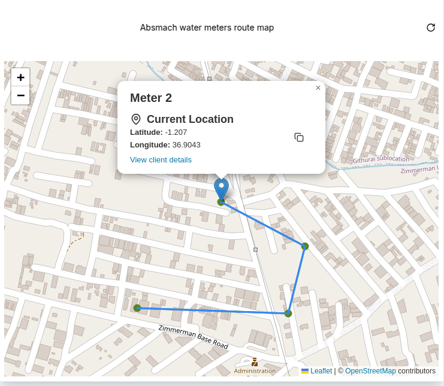

You can also add new data sources and have them show up on the map as well as shown below:

  

#### Route Map Popups

Each point on the map representing a message has an interactive popup with more details about the entity. The popup includes:

- **Label**: The label assigned to the route.
- **Current Location**: Displays the current location based on the latest message.
- **Latitude and Longitude**: The exact coordinates of the location, which can be copied to the clipboard.
- **View Thing Details**: A link to the specific entity's details page.

  

#### Summary

Route Maps provide a dynamic way to visualize the movement or changes in location of your devices over time.
By retrieving location data from messages, these maps enable real-time tracking and historical path analysis.
With customizable settings such as update intervals and time windows, Route Maps offer flexibility in monitoring IoT devices' geographical movements.
Users can track multiple devices, review their routes, and access detailed information via interactive popups, making Route Maps an essential tool for IoT asset management.
